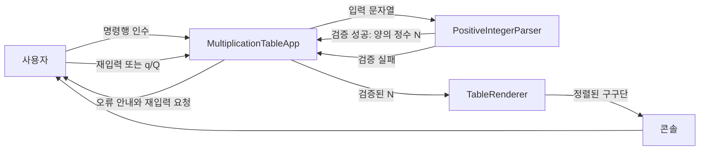
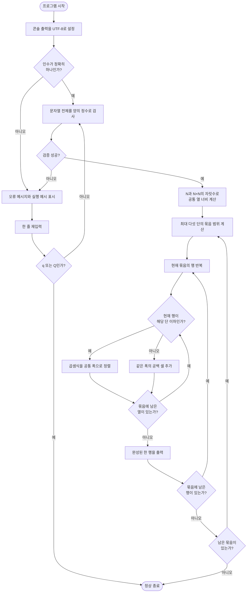
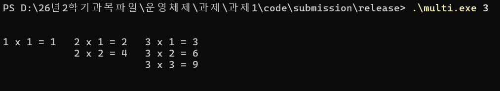
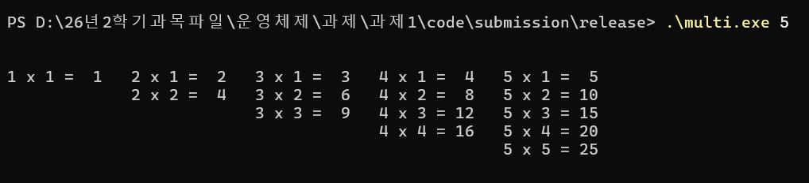
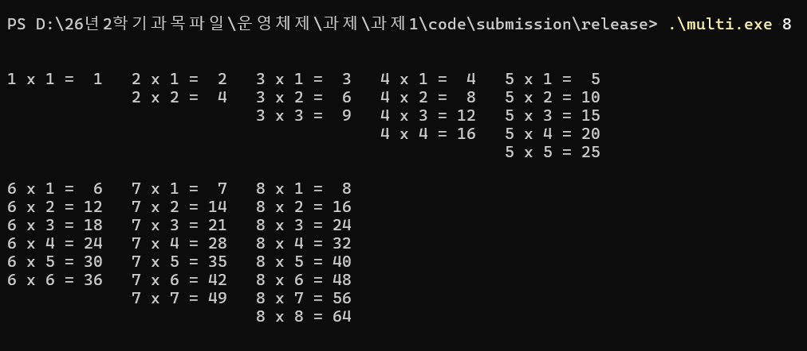
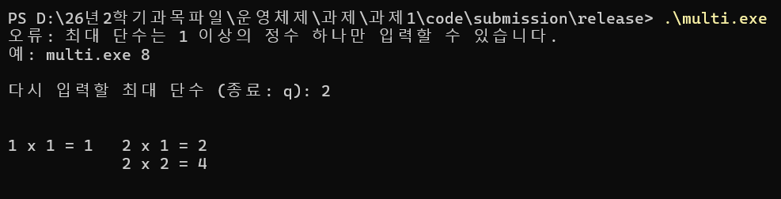
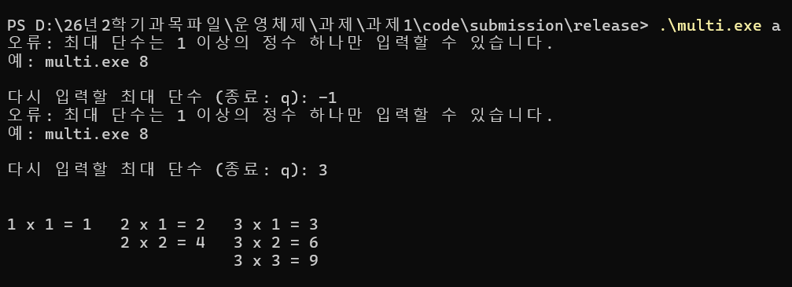
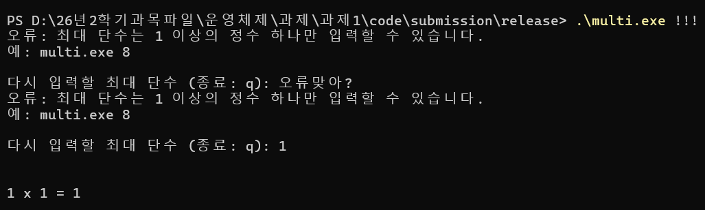

# Programming Assignment 01

## Multiplication Table

| 구분 | 내용 |
|---|---|
| 과목 | DCCS301 Operating System |
| 작성자 | 전남규 |
| 학번 | 2020271319 |
| 개발 언어 | C++17 |
| 개발 환경 | Windows, Visual Studio Community 2026 |
| 빌드 구성 | Release / x64 |
| 실행 파일 | `multi.exe` |

명령행에서 입력받은 최대 단수까지 삼각형 형태의 구구단을 출력하는 콘솔 프로그램입니다. 다섯 단을 한 묶음으로 배치하고, 숫자의 자릿수가 달라져도 모든 묶음의 열이 같은 위치에 정렬되도록 구현했습니다.

## 목차

1. [프로그램 개요](#1-프로그램-개요)
2. [시스템 설명](#2-시스템-설명)
3. [테스트 결과 설명](#3-테스트-결과-설명)
4. [사용자 설명](#4-사용자-설명)
5. [자기 평가](#5-자기-평가)

## 1. 프로그램 개요

`multi.exe N` 형식으로 양의 정수 N을 전달하면 1단부터 N단까지 출력합니다. 각 단 `d`는 `d x 1`부터 `d x d`까지만 표시되므로 전체 결과는 아래로 갈수록 길어지는 삼각형 구조가 됩니다.

주요 기능은 다음과 같습니다.

- 다섯 단씩 가로로 묶어 출력합니다.
- 묶음 사이와 표 앞뒤에 빈 줄을 두어 결과를 구분합니다.
- 끝난 단의 위치를 공백으로 유지하여 오른쪽 열이 움직이지 않게 합니다.
- 전체 최대 단수의 자릿수를 기준으로 모든 묶음의 열 너비를 통일합니다.
- 명령행 인수가 올바르지 않으면 프로그램 안에서 다시 입력받습니다.
- 재입력 중 `q` 또는 `Q`를 입력하면 정상 종료합니다.
- `int` 범위 안의 모든 양의 정수를 허용하며 임의의 최대 단수를 두지 않습니다.

## 2. 시스템 설명

### 2.1 시스템 구성

프로그램을 실행 흐름, 입력 검증, 표 생성의 세 부분으로 나누었습니다. 각 부분은 한 가지 책임만 담당하므로 입력 규칙이나 출력 형식을 독립적으로 확인하고 수정할 수 있습니다.

| 구성 요소 | 역할 |
|---|---|
| `main.cpp` | Windows 콘솔의 UTF-8 출력 환경을 준비하고 프로그램을 시작합니다. |
| `MultiplicationTableApp` | 인수 개수 확인, 오류 안내, 재입력, 종료와 렌더러 호출을 관리합니다. |
| `PositiveIntegerParser` | 문자열 전체가 1 이상 `int` 범위의 정수인지 검사하고 변환합니다. |
| `TableRenderer` | 다섯 단 묶음, 삼각형 행, 빈 셀과 공통 열 정렬을 계산해 출력합니다. |

### 2.2 데이터 흐름도



명령행 인수와 재입력 값은 모두 같은 파서를 거칩니다. 입력 위치가 달라도 숫자, 범위와 공백에 동일한 검증 규칙이 적용됩니다.

### 2.3 프로그램 순서도



### 2.4 주요 클래스와 함수

| 클래스·함수 | 입력 | 반환값 | 역할 |
|---|---|---|---|
| `main` | `argc`, `argv` | 종료 코드 | 콘솔 환경을 설정하고 앱을 실행합니다. |
| `MultiplicationTableApp::Run` | 명령행 인수 | 종료 코드 | 인수 개수를 검사하고 파서·렌더러를 연결합니다. |
| `ReadMaximumTable` | 입력·출력 스트림 | `optional<int>` | 올바른 값 또는 종료 요청을 받을 때까지 재입력합니다. |
| `PrintInputError` | 출력 스트림 | 없음 | 오류 이유와 올바른 실행 예시를 표시합니다. |
| `PositiveIntegerParser::Parse` | 입력 문자열 | `optional<int>` | 문자열 전체를 엄격하게 검사하고 정수로 변환합니다. |
| `MakeLayout` | 최대 단수 N | `TableLayout` | 전체 표가 공유할 숫자 폭과 열 너비를 계산합니다. |
| `AppendExpression` | 단, 승수, 열 배치 | 없음 | 한 곱셈식을 현재 행 버퍼에 정렬하여 추가합니다. |
| `TableRenderer::Render` | 최대 단수, 출력 스트림 | 없음 | 묶음과 행을 순회하며 최종 표를 출력합니다. |

### 2.5 입력 검증 알고리즘

파서는 문자열을 처음부터 끝까지 한 번 순회합니다. 각 문자가 ASCII 숫자 `'0'`부터 `'9'` 사이인지 확인하므로 문자, 부호, 소수점, 쉼표와 공백이 하나라도 포함된 입력은 거부됩니다.

새 자릿수를 더하기 전에 다음 조건으로 `int` 범위 초과 여부를 확인합니다.

```text
value > (INT_MAX - digit) / 10
```

범위를 넘는 계산을 실행하기 전에 실패를 반환하므로 정수 오버플로가 발생하지 않습니다. 모든 자릿수를 처리한 값이 0이면 양의 정수가 아니므로 거부합니다.

- 시간 복잡도: 입력 문자열의 길이를 L이라 할 때 O(L)
- 추가 공간: O(1)

### 2.6 공통 열 정렬 알고리즘

묶음마다 다른 폭을 사용하면 1–5단, 6–10단, 11–15단의 시작 위치가 달라집니다. 이를 방지하기 위해 최대 단수 N에서 전체 표가 공유할 폭을 한 번 계산합니다.

```text
단 번호 폭 = digits(N)
승수 폭    = digits(N)
결과 폭    = digits(N × N)
한 열 폭   = 단 번호 폭 + " x " + 승수 폭 + " = " + 결과 폭
```

예를 들어 15단을 출력할 때는 1단과 11단의 숫자 길이가 달라도 두 자리 단 번호 폭과 세 자리 결과 폭을 공통으로 사용합니다. 따라서 1·6·11단, 2·7·12단처럼 위아래 묶음의 시작 위치와 `x`, `=`, 결과의 끝 위치가 일치합니다.

### 2.7 삼각형 구조와 빈 셀 처리

단 `d`는 `d`번째 행까지만 식을 가집니다. 현재 행 번호가 단보다 크면 해당 단은 끝났지만, 열을 생략하면 오른쪽 단이 왼쪽으로 이동합니다. 이 경우 곱셈식 대신 같은 열 너비의 공백을 넣어 세로 정렬을 유지합니다.

묶음의 시작 단은 1, 6, 11처럼 다섯씩 증가합니다. 마지막 묶음에 다섯 단이 모두 존재하지 않을 수 있으므로 묶음의 끝은 N을 넘지 않도록 계산합니다.

### 2.8 출력 효율성

전체 표를 2차원 배열이나 하나의 큰 문자열에 저장하지 않습니다. 최대 다섯 칸으로 구성된 한 행만 만든 뒤 `ostream::write`로 출력하고 다음 행으로 넘어갑니다. 숫자 변환에는 `std::to_chars`와 고정 크기 버퍼를 사용해 반복적인 스트림 포맷팅과 임시 문자열 생성을 줄였습니다.

1단부터 N단까지 생성되는 식의 수는 다음과 같습니다.

```text
1 + 2 + ... + N = N(N + 1) / 2
```

모든 식을 실제로 출력해야 하므로 시간 복잡도는 O(N²)입니다. 추가 메모리는 공통 배치 정보와 한 행 버퍼만 사용하므로 숫자의 자릿수를 포함해 O(log N)입니다. Release/x64 실행 파일에서 N=1,000의 출력을 `NUL`로 보낸 세 번의 측정값은 94.94ms, 77.38ms, 95.57ms였고 평균은 89.30ms였습니다. 화면에 직접 출력할 때는 계산보다 터미널이 문자를 그리는 시간이 더 큰 영향을 줍니다.

### 2.9 프로젝트 구조

```text
project/
├─ multi.sln
├─ multi.vcxproj
├─ multi.vcxproj.filters
└─ src/
   ├─ main.cpp
   ├─ app/
   │  ├─ MultiplicationTableApp.h
   │  └─ MultiplicationTableApp.cpp
   ├─ input/
   │  ├─ PositiveIntegerParser.h
   │  └─ PositiveIntegerParser.cpp
   └─ output/
      ├─ TableRenderer.h
      └─ TableRenderer.cpp
```

[전체 소스 코드 보기](https://github.com/Namgyu-Jeon/OS_assignments/tree/main/assignments/assignment-01/project/src)

## 3. 테스트 결과 설명

### 3.1 테스트 환경

| 항목 | 환경 |
|---|---|
| 운영체제 | Windows |
| IDE | Visual Studio Community 2026 v18.9.2 |
| 컴파일러 | MSVC v145 |
| 언어 표준 | C++17 |
| 빌드 구성 | Release / x64 |
| 실행 파일 | `multi.exe` |

정상 입력은 실행 결과 전체를 예상 문자열과 비교했습니다. 곱셈식뿐 아니라 표 앞뒤의 빈 줄, 묶음 사이의 빈 줄, 끝난 단의 공백 셀과 열 위치도 함께 확인했습니다. 오류 입력은 오류 메시지, 재입력 동작과 종료 코드를 검사했습니다.

### 3.2 정상 입력 테스트

| 입력 N | 확인 내용 | 실제 결과 | 판정 |
|---:|---|---|:---:|
| 1 | 한 개의 식만 출력 | `1 x 1 = 1` 출력 | 통과 |
| 3 | 한 묶음의 삼각형 구조 | 식 6개와 공백 열 일치 | 통과 |
| 5 | 첫 번째 묶음의 경계 | 1–5단, 식 15개 출력 | 통과 |
| 6 | 두 번째 묶음 시작 | 1–5단과 6단으로 분리 | 통과 |
| 8 | 마지막 묶음이 3개 열인 경우 | 1–5단과 6–8단 출력 | 통과 |
| 10 | 두 묶음이 모두 5개 열인 경우 | 1–5단과 6–10단 출력 | 통과 |
| 15 | 세 묶음과 두·세 자리 결과 정렬 | 식 120개, 모든 열 좌표 일치 | 통과 |
| 20 | 네 묶음 출력 | 식 210개, 묶음과 열 정렬 일치 | 통과 |

N=15에서는 각 묶음의 다섯 열에 대해 시작 위치, `x`, `=`와 결과 끝 위치가 같은지 추가로 비교했습니다. 큰 자릿수의 동적 정렬은 N=100의 전체 결과 비교로도 확인했습니다.

### 3.3 오류 및 재입력 테스트

| 입력 상황 | 테스트 값 | 실제 결과 | 판정 |
|---|---|---|:---:|
| 인수 없음 | 실행 후 `15` 입력 | 오류 안내 후 15단 출력 | 통과 |
| 인수 두 개 이상 | `8 9`, 이후 `15` | 오류 안내 후 정상 재입력 | 통과 |
| 문자 포함 | `abc`, `8a` | 모두 거부 | 통과 |
| 소수점·기호 포함 | `8.0`, `.`, `8,` | 모두 거부 | 통과 |
| 0 또는 음수 | `0`, `-1` | 모두 거부 | 통과 |
| 정수 범위 초과 | `2147483648` | 오버플로 없이 거부 | 통과 |
| 공백 포함 | `"15 "`, `" 15"` | 문자열 전체 검사로 거부 | 통과 |
| 재입력 성공 | 잘못된 값 이후 `15` | 같은 검사 규칙 적용 후 출력 | 통과 |
| 사용자 종료 | `q`, `Q` | 종료 코드 0으로 정상 종료 | 통과 |

### 3.4 실제 실행 화면

#### N=3

```powershell
.\multi.exe 3
```



#### N=5

```powershell
.\multi.exe 5
```



#### N=8

```powershell
.\multi.exe 8
```



#### N=15

```powershell
.\multi.exe 15
```


15단 결과에서 각 묶음의 첫 번째 열인 1단, 6단과 11단이 같은 위치에서 시작합니다. 나머지 네 개 열도 같은 세로 기준선을 유지하며, 결과가 세 자리가 되어도 `x`, `=`와 결과의 끝 위치가 일치합니다.

#### 오류 처리: 인수 없이 실행 후 재입력

명령행 인수가 없을 때 오류 안내를 표시하고, 다시 입력한 `2`를 검증한 뒤 2단까지 정상적으로 출력했습니다.



#### 오류 처리: 문자와 음수 입력 후 재입력

문자 인수 `a`와 재입력 값 `-1`을 차례로 거부하고, 다음 입력 `3`을 받아 3단까지 정상적으로 출력했습니다.



#### 오류 처리: 기호와 한글 입력 후 재입력

기호 인수 `!!!`와 한글 재입력 값을 모두 거부하고, 다음 입력 `1`을 받아 1단을 정상적으로 출력했습니다.



## 4. 사용자 설명

### 4.1 준비 환경

- Windows 10 또는 Windows 11
- **Desktop development with C++** 워크로드가 설치된 Visual Studio Community 2026
- 외부 라이브러리는 필요하지 않습니다.

### 4.2 소스 내려받기

1. GitHub 저장소 상단의 `Code` 버튼을 누릅니다.
2. `Download ZIP`을 선택한 뒤 압축을 풉니다.
3. `assignments\assignment-01\project` 폴더로 이동합니다.

### 4.3 Visual Studio에서 컴파일

1. `multi.sln`을 Visual Studio Community 2026으로 엽니다.
2. 상단의 솔루션 구성에서 `Release`를 선택합니다.
3. 솔루션 플랫폼에서 `x64`를 선택합니다.
4. `빌드 > 솔루션 빌드`를 누르거나 `Ctrl+Shift+B`를 입력합니다.
5. 빌드가 완료되면 다음 위치에 실행 파일이 생성됩니다.

```text
project\build\x64\Release\multi.exe
```

소스 코드를 수정하고 다시 빌드하면 같은 위치의 실행 파일이 새 내용으로 갱신됩니다.

### 4.4 PowerShell에서 실행

`project` 폴더에서 PowerShell을 열고 다음 명령을 실행합니다.

```powershell
.\build\x64\Release\multi.exe 15
```

실행 파일이 있는 `build\x64\Release` 폴더에서 실행한다면 다음과 같이 입력합니다.

```powershell
.\multi.exe 15
```

PowerShell에서는 현재 폴더의 실행 파일을 나타내는 `.\`이 필요합니다.

### 4.5 명령 프롬프트에서 실행

`project` 폴더에서 명령 프롬프트(cmd)를 열고 실행합니다.

```bat
build\x64\Release\multi.exe 15
```

실행 파일이 있는 폴더에서는 다음 명령도 사용할 수 있습니다.

```bat
multi.exe 15
```

### 4.6 입력 오류와 재입력

명령행에는 1 이상의 정수 하나만 전달해야 합니다. 입력이 올바르지 않으면 다음 안내가 표시됩니다.

```text
오류: 최대 단수는 1 이상의 정수 하나만 입력할 수 있습니다.
예: multi.exe 8

다시 입력할 최대 단수 (종료: q):
```

재입력에서도 같은 형식 검사를 사용합니다. 올바른 정수를 입력하면 구구단을 출력하고, `q` 또는 `Q`를 입력하면 정상 종료합니다.

### 4.7 실행 창이 바로 닫히는 경우

파일 탐색기에서 `multi.exe`를 더블클릭하면 별도의 콘솔 창에서 실행됩니다. 출력이 끝나면 프로그램도 정상 종료되므로 창이 바로 닫힐 수 있습니다. 결과를 확인하려면 PowerShell이나 명령 프롬프트를 먼저 열고 위 명령으로 실행합니다.

## 5. 자기 평가

### 독창성: 85 / 100

구구단 출력은 기본적인 반복문 문제이지만, 정해진 예시만 출력하는 방식이 아니라 입력값의 크기에 따라 표 전체를 자동으로 구성하도록 구현했습니다.

가장 중점을 둔 부분은 공통 열 정렬입니다. 묶음별로 너비를 계산하지 않고 최대 단수와 최대 결과의 자릿수에서 표 전체의 열 폭을 한 번 계산했습니다. 덕분에 한 자리 단과 두 자리 단이 섞이거나 결과가 세 자리 이상으로 커져도 모든 묶음이 같은 세로 격자를 유지합니다. 이미 끝난 단에는 같은 폭의 빈 셀을 넣어 삼각형 모양과 정렬을 함께 만족시켰습니다.

입력 처리에서는 문자열 일부만 숫자로 변환하는 방식을 사용하지 않았습니다. 모든 문자를 직접 검사하고 계산 전에 범위 초과를 확인하여 문자, 공백, 부호, 소수점과 너무 큰 수를 엄격하게 구분했습니다. 명령행과 재입력에 같은 파서를 적용해 두 입력 방식의 규칙도 일치시켰습니다.

출력 과정은 전체 표를 메모리에 저장하지 않고 한 행씩 생성하도록 구성했습니다. 역할에 따라 실행 흐름, 입력 검사와 표 생성을 서로 다른 클래스로 분리하고, 이름 있는 상수와 한국어 주석을 사용해 코드의 의도를 쉽게 확인할 수 있도록 했습니다.

기본 문제의 범위를 완전히 새로운 알고리즘으로 바꾼 것은 아니므로 만점으로 평가하지 않았습니다. 다만 엄격한 입력 검증, 오류 후 재입력, 자릿수 기반 공통 열 정렬, 행 단위 출력과 모듈화를 통해 다양한 입력에서도 안정적으로 동작하도록 완성한 점을 반영해 85점으로 평가했습니다.
