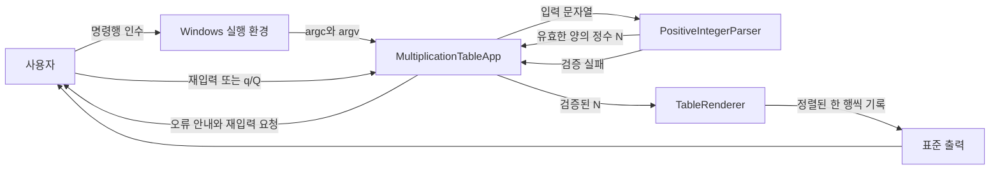
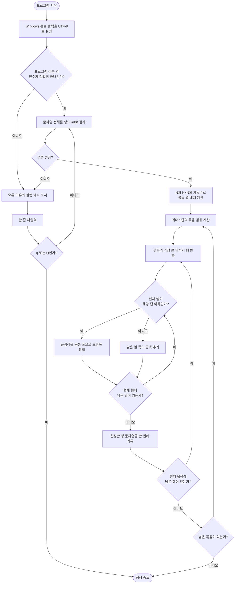

# 시스템 설명

[과제 1 보고서로 돌아가기](../README.md)

## 1. 설계 목표

프로그램은 입력 검증, 실행 흐름, 표 렌더링을 분리했습니다. 이 구조는 잘못된 입력 처리와 출력 정렬이 서로 영향을 주지 않게 하며, 각 모듈을 한 가지 책임에 집중시킵니다.

## 2. 데이터 흐름도



명령행과 재입력은 모두 같은 파서를 거칩니다. 따라서 시작할 때는 허용하지 않던 값을 재입력에서는 허용하는 식의 규칙 차이가 생기지 않습니다.

## 3. 프로그램 순서도



## 4. 파일과 주요 함수

| 파일 | 클래스·함수 | 책임 |
|---|---|---|
| [`main.cpp`](../project/src/main.cpp) | `main` | UTF-8 콘솔 환경과 빠른 iostream 설정을 준비하고 앱의 종료 코드를 반환합니다. |
| [`MultiplicationTableApp.h`](../project/src/app/MultiplicationTableApp.h) | `MultiplicationTableApp` | 프로그램의 전체 실행 흐름을 선언합니다. |
| [`MultiplicationTableApp.cpp`](../project/src/app/MultiplicationTableApp.cpp) | `Run` | 인수 개수를 확인하고 파서와 렌더러를 연결합니다. |
| 같은 파일 | `ReadMaximumTable` | 오류 뒤 재입력을 반복하고 `q/Q` 종료를 처리합니다. |
| 같은 파일 | `PrintInputError` | 모든 잘못된 입력에 동일한 오류 기준과 예시를 표시합니다. |
| [`PositiveIntegerParser.cpp`](../project/src/input/PositiveIntegerParser.cpp) | `Parse` | 문자열 전체가 1 이상 `int` 범위의 ASCII 숫자인지 검사합니다. |
| [`TableRenderer.cpp`](../project/src/output/TableRenderer.cpp) | `MakeLayout` | N과 N×N의 자릿수로 전체 표의 공통 열 폭을 계산합니다. |
| 같은 파일 | `AppendExpression` | 단·승수·결과를 공통 폭에 맞춰 한 행 버퍼에 추가합니다. |
| 같은 파일 | `Render` | 다섯 단 묶음, 삼각형 행, 공백 열과 묶음 사이 빈 줄을 처리합니다. |

## 5. 핵심 알고리즘

### 5.1 엄격한 양의 정수 파싱

파서는 문자열을 앞에서부터 한 번만 읽습니다. 문자가 `'0'`부터 `'9'` 사이가 아니면 즉시 실패하므로 문자, 공백, 부호, 소수점, 쉼표가 섞인 입력을 부분적으로 받아들이지 않습니다.

다음 자릿수를 누적하기 전 `(INT_MAX - digit) / 10`과 비교하여 계산 자체가 정수 범위를 넘기 전에 차단합니다. 마지막으로 값이 0이면 양의 정수가 아니므로 거부합니다.

- 시간 복잡도: 입력 길이를 L이라 할 때 O(L)
- 추가 공간: O(1)

### 5.2 전체 최대값 기반 공통 열 격자

최대 단수가 N일 때 공통 폭은 다음 세 값으로 결정합니다.

```text
단 번호 폭 = digits(N)
승수 폭    = digits(N)
결과 폭    = digits(N × N)
한 열 폭   = 단 번호 폭 + 3 + 승수 폭 + 3 + 결과 폭
```

두 번의 `3`은 문자열 `" x "`와 `" = "`의 길이입니다. 이 배치를 모든 묶음에 재사용하므로 15단 출력에서 1·6·11단, 2·7·12단 등이 동일한 세로 열에 놓입니다. 고정 숫자 폭을 사용하지 않으므로 N이 커져도 같은 규칙으로 자동 확장됩니다.

### 5.3 삼각형 구조와 공백 셀

단 `d`는 `d`번째 행까지만 식이 존재합니다. 현재 행이 해당 단보다 크면 그 단은 끝난 상태이지만, 열 자체를 생략하면 오른쪽 단이 왼쪽으로 움직입니다. 따라서 공통 열 폭만큼 공백을 넣어 빈 셀을 유지합니다.

묶음의 시작은 1, 6, 11처럼 다섯씩 증가합니다. 끝 단은 남은 단이 다섯보다 적을 수 있으므로 N을 넘지 않도록 계산합니다. 덧셈 전에 범위를 비교하여 `int` 최댓값 근처에서도 불필요한 오버플로가 발생하지 않게 했습니다.

### 5.4 스트리밍 출력

전체 표를 2차원 배열이나 하나의 거대한 문자열에 저장하지 않습니다. 최대 다섯 개 열로 한 행을 만들고 `ostream::write`로 한 번에 기록한 뒤 다음 행으로 넘어갑니다. 숫자 변환에는 `std::to_chars`와 고정 크기 버퍼를 사용하여 셀마다 별도 스트림과 임시 숫자 문자열을 만들지 않습니다.

1단부터 N단까지 필요한 식의 수는 다음과 같습니다.

```text
1 + 2 + ... + N = N(N + 1) / 2
```

따라서 모든 식을 실제로 출력하는 시간 복잡도는 O(N²)이며, 이는 요구된 결과 전체를 생성하기 위해 피할 수 없는 출력량입니다. 추가 메모리는 공통 배치 정보와 한 행 버퍼뿐이므로 숫자 자릿수를 포함해 O(log N)입니다.

## 6. 설계에서 개선한 점

- `atoi`처럼 숫자 앞부분만 변환하는 방식 대신 문자열 전체 검증을 사용했습니다.
- 열 너비를 단마다 계산하지 않고 전체 최대값에서 한 번 계산해 위아래 묶음까지 정렬했습니다.
- 끝난 단을 공백 셀로 유지하여 삼각형 모양과 열 격자를 동시에 만족시켰습니다.
- 전체 표 저장 없이 행 단위로 출력해 메모리 사용을 제한했습니다.
- 실행 흐름, 입력 규칙, 출력 알고리즘을 모듈로 분리해 읽고 수정하기 쉽게 구성했습니다.

## 7. 실제 성능 측정

최종 Release/x64 실행 파일에서 N=1,000 출력을 화면 대신 `NUL`로 보낸 실제 측정입니다. 터미널의 화면 그리기 시간은 포함하지 않습니다.

| 실행 | 측정 시간 |
|---:|---:|
| 1회 | 94.94 ms |
| 2회 | 77.38 ms |
| 3회 | 95.57 ms |
| 평균 | 89.30 ms |

큰 N에서는 계산보다 터미널에 수많은 문자를 표시하는 시간이 지배적입니다. 예를 들어 N=1,111,111이면 출력해야 하는 식이 617,284,382,716개이므로 빠른 문자열 생성만으로 현실적인 시간 안에 화면 출력을 끝낼 수는 없습니다. 과제 요구에 따라 임의의 최대값은 두지 않았습니다.
