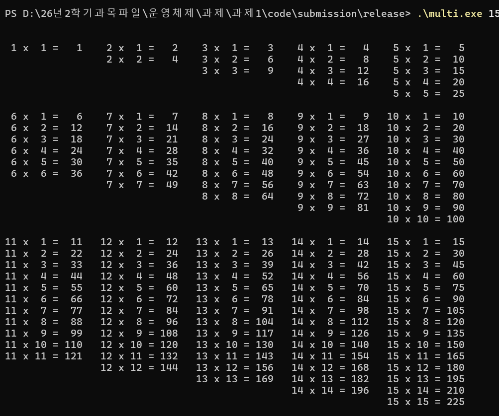

# 테스트 설명

[과제 1 보고서로 돌아가기](../README.md)

## 1. 검증 환경과 방법

| 항목 | 실제 환경 |
|---|---|
| 운영체제 | Windows |
| IDE | Visual Studio Community 2026 v18.9.2 |
| 컴파일러 도구 집합 | MSVC v145 |
| 언어 설정 | C++17 |
| 빌드 구성 | Release / x64 |
| 실행 파일 | `multi.exe` |

정상 입력은 프로그램 출력 전체를 별도로 생성한 기대 문자열과 문자 단위로 비교했습니다. 이 비교에는 표 앞뒤 빈 줄, 묶음 사이 빈 줄, 끝난 단의 공백, 공통 열 시작점, 오른쪽 정렬과 Windows `CRLF` 줄바꿈이 모두 포함됩니다.

오류 입력은 오류 횟수, 안내 예시, 재입력 프롬프트, 정상 복구 결과와 종료 코드를 확인했습니다. 표와 수치는 2026-09-08에 최종 Release/x64 실행 파일을 실제로 실행해 기록했습니다.

## 2. 정상 입력 결과

| N | 기대 결과 | 실제 결과 | 판정 |
|---:|---|---|:---:|
| 1 | 한 묶음, 식 1개 | 5행, 19문자, 식 1개 | 통과 |
| 3 | 한 묶음, 삼각형 식 6개 | 7행, 113문자, 식 6개 | 통과 |
| 5 | 한 묶음, 식 15개 | 9행, 328문자, 식 15개 | 통과 |
| 6 | 두 묶음, 식 21개 | 16행, 402문자, 식 21개 | 통과 |
| 8 | 두 묶음, 식 36개 | 18행, 634문자, 식 36개 | 통과 |
| 10 | 두 묶음, 식 55개 | 20행, 1,195문자, 식 55개 | 통과 |
| 15 | 세 묶음, 식 120개 | 36행, 2,382문자, 식 120개 | 통과 |
| 20 | 네 묶음, 식 210개 | 57행, 3,964문자, 식 210개 | 통과 |
| 100 | 스무 묶음, 식 5,050개 | 1,073행, 103,996문자, 식 5,050개 | 통과 |

N=15에서는 다섯 열의 `x`, `=`, 결과 끝 위치가 세 묶음 전체에서 각각 동일한 좌표인지 추가 검사했습니다. N=100에서도 전체 출력이 기대 문자열과 정확히 일치했습니다.

## 3. 오류와 재입력 결과

| 입력 상황 | 제공한 값 | 확인 결과 | 판정 |
|---|---|---|:---:|
| 인수 없음 | 실행 후 `15` | 오류 1회 후 15단 출력, 종료 코드 0 | 통과 |
| 인수 둘 이상 | `8 9`, 이후 `15` | 오류 1회 후 정상 복구 | 통과 |
| 문자 포함 | `abc`, `8a` | 모두 거부 | 통과 |
| 소수점·기호 | `8.0`, `.`, `8,` | 모두 거부 | 통과 |
| 0·음수 | `0`, `-1` | 모두 거부 | 통과 |
| 범위 초과 | `2147483648` | 오버플로 없이 거부 | 통과 |
| 공백 포함 | `"15 "`, `" 15"` | 문자열 전체 검증으로 거부 | 통과 |
| 재입력 성공 | 잘못된 값 뒤 `15` | 같은 파서로 재검증 후 출력 | 통과 |
| 종료 | `q`, `Q` | 표 없이 종료 코드 0 | 통과 |

## 4. 실제 실행 화면

아래 네 이미지는 최종 프로그램을 PowerShell에서 직접 실행해 촬영한 원본 결과입니다. 출력처럼 보이도록 다시 만든 이미지나 임의 데이터는 사용하지 않았습니다.

### N=3

실행 명령: `.\multi.exe 3`

### N=5

실행 명령: `.\multi.exe 5`

### N=8

실행 명령: `.\multi.exe 8`

### N=15

실행 명령: `.\multi.exe 15`

15단 화면에서는 한 자리 단 앞의 공백과 세 자리 결과 폭을 확인할 수 있습니다. 1·6·11단을 포함한 각 세로 열의 `x`, `=`, 결과 끝 위치가 위아래 묶음에서 동일합니다.

## 5. 증거의 한계

- 실행 시간은 현재 컴퓨터에서 화면 출력을 `NUL`로 보낸 측정값이며 다른 컴퓨터의 성능을 보장하지 않습니다.
- 콘솔 스크린샷은 3·5·8·15단의 대표 실행을 보여 주며, 나머지 입력은 자동 문자열 비교 결과로 기록했습니다.
- Visual Studio에서 솔루션을 여는 최종 화면 확인은 제출자가 GitHub 공개본을 검토할 때 수행합니다.
