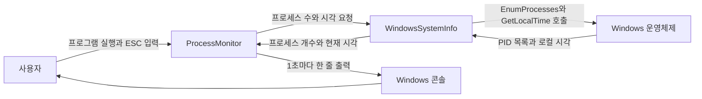
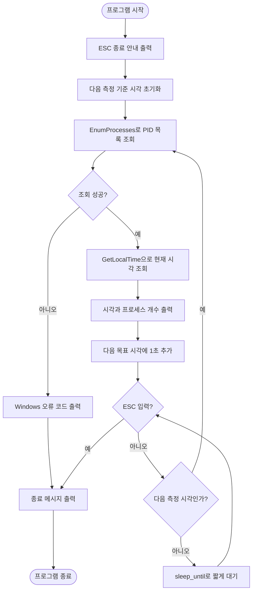
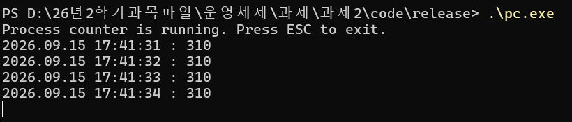
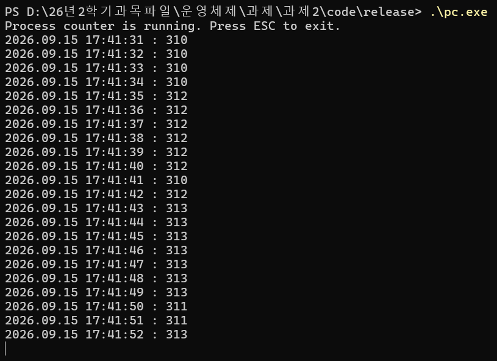
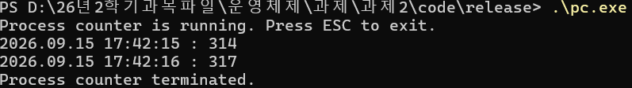

# Programming Assignment 02

## Process Counter

| 구분 | 내용 |
|---|---|
| 과목 | DCCS301 Operating System |
| 작성자 | 전남규 |
| 학번 | 2020271319 |
| 개발 언어 | C++17 |
| 개발 환경 | Windows, Visual Studio Community 2026 |
| 빌드 구성 | Release / x64 |
| 실행 파일 | `pc.exe` |

Windows 운영체제에 현재 실행 중인 프로세스 정보를 요청하고, 현재 로컬 시각과 프로세스 개수를 1초마다 출력하는 콘솔 프로그램입니다. 프로그램을 실행하면 첫 측정값이 바로 표시되며, 사용자가 ESC를 누를 때까지 새로운 값을 계속 출력합니다.

## 목차

1. [프로그램 개요](#1-프로그램-개요)
2. [시스템 설명](#2-시스템-설명)
3. [테스트 결과 설명](#3-테스트-결과-설명)
4. [사용자 설명](#4-사용자-설명)
5. [자기 평가](#5-자기-평가)

## 1. 프로그램 개요

`pc.exe`는 실행 시점의 로컬 날짜와 시간, Windows에서 실행 중인 프로세스 개수를 다음 형식으로 출력합니다.

```text
2026.09.15 17:41:31 : 310
2026.09.15 17:41:32 : 310
2026.09.15 17:41:33 : 310
```

주요 기능은 다음과 같습니다.

- 프로그램 시작 직후 첫 측정값을 출력합니다.
- 이후 약 1초마다 운영체제에 새로 요청한 프로세스 개수를 출력합니다.
- Windows가 제공하는 `EnumProcesses()`로 PID 목록을 가져옵니다.
- Windows가 제공하는 `GetLocalTime()`으로 출력 시점의 로컬 날짜와 시간을 가져옵니다.
- 프로세스 수가 준비한 버퍼보다 많으면 버퍼를 확장해 누락을 막습니다.
- ESC 입력을 비차단 방식으로 확인하므로 Enter를 추가로 누를 필요가 없습니다.
- ESC 이외의 키는 프로그램을 종료시키지 않습니다.
- 짧은 대기 동안 실행 스레드를 재워 불필요한 CPU 사용을 줄입니다.

## 2. 시스템 설명

### 2.1 시스템 구성

프로그램은 시작점, 반복 실행 관리, Windows 시스템 정보 조회의 세 부분으로 나누었습니다. 콘솔 실행 흐름과 Windows API 사용을 분리하여 각 부분의 역할을 쉽게 확인할 수 있습니다.

| 구성 요소 | 역할 |
|---|---|
| `main.cpp` | 프로그램을 시작하고 메모리 부족이나 예상하지 못한 예외를 최종 처리합니다. |
| `ProcessMonitor` | 시작·종료 안내, 1초 측정 주기, 결과 출력과 ESC 입력 확인을 관리합니다. |
| `WindowsSystemInfo` | Windows API를 호출해 현재 PID 목록과 로컬 시각을 가져옵니다. |

### 2.2 사용한 Windows API

이 프로그램의 프로세스 수와 현재 시각은 C++ 표준 함수로 대신 계산하지 않고 Windows에서 제공하는 API를 직접 사용합니다.

#### `EnumProcesses()`

[`EnumProcesses()`](https://learn.microsoft.com/en-us/windows/win32/api/psapi/nf-psapi-enumprocesses)는 현재 시스템에 존재하는 각 프로세스의 식별자(PID)를 배열에 채워 주는 Windows API입니다. `WindowsSystemInfo.cpp`에서 매 측정 시점마다 이 함수를 다시 호출합니다.

- 헤더: `<Psapi.h>`
- 링크 라이브러리: `Psapi.lib`
- 성공 결과: PID 배열에 실제로 기록된 바이트 수
- 개수 계산: `반환된 바이트 수 / sizeof(DWORD)`
- 실패 처리: 반환값을 확인한 뒤 `GetLastError()`로 Windows 오류 코드를 보존
- 버퍼 부족 처리: 반환 바이트 수가 전달한 버퍼 크기와 같으면 버퍼를 두 배로 늘려 재호출

#### `GetLocalTime()`

[`GetLocalTime()`](https://learn.microsoft.com/en-us/windows/win32/api/sysinfoapi/nf-sysinfoapi-getlocaltime)은 현재 컴퓨터에 설정된 로컬 날짜와 시간을 `SYSTEMTIME` 구조체에 채워 주는 Windows API입니다. 프로그램은 출력할 때마다 이 함수를 새로 호출하고 연도, 월, 일, 시, 분, 초를 사용합니다.

- 헤더: `<Windows.h>`
- 반환 정보: 현재 로컬 날짜와 시간
- 출력 형식: `YYYY.MM.DD HH:MM:SS`
- 월, 일, 시, 분, 초는 빈자리를 0으로 채워 두 자리로 표시

### 2.3 데이터 흐름도



`ProcessMonitor`는 시스템 정보가 필요할 때마다 `WindowsSystemInfo`에 요청합니다. `WindowsSystemInfo`가 Windows 운영체제에서 받은 PID 목록을 개수로 계산하고 로컬 시각과 함께 돌려주면, `ProcessMonitor`가 한 줄로 조합해 콘솔에 출력합니다.

### 2.4 프로그램 순서도



### 2.5 주요 클래스와 함수

| 클래스·함수 | 입력 | 반환값 | 역할 |
|---|---|---|---|
| `main` | 없음 | 종료 코드 | 모니터를 실행하고 처리되지 않은 예외를 최종 정리합니다. |
| `ProcessMonitor::Run` | 없음 | 종료 코드 | 안내, 반복 측정, 출력, ESC 확인과 종료를 관리합니다. |
| `WaitUntilNextSampleOrEscape` | 다음 측정 목표 시각 | `bool` | 목표 시각까지 기다리며 ESC 입력을 확인합니다. |
| `PrintSample` | 로컬 시각, 프로세스 수 | 없음 | 한 측정값을 지정된 형식으로 출력합니다. |
| `WindowsSystemInfo::QueryProcessCount` | 없음 | `ProcessCountResult` | PID 목록을 받아 현재 프로세스 개수를 계산합니다. |
| `WindowsSystemInfo::GetCurrentLocalDateTime` | 없음 | `LocalDateTime` | Windows의 현재 로컬 날짜와 시간을 가져옵니다. |

### 2.6 프로세스 개수 계산과 버퍼 확장

PID 버퍼는 256개로 시작합니다. `EnumProcesses()`가 돌려준 바이트 수가 전달한 버퍼 크기보다 작으면 모든 PID가 들어온 것으로 보고 다음 식으로 프로세스 개수를 계산합니다.

```text
프로세스 개수 = 반환된 바이트 수 / sizeof(DWORD)
```

두 크기가 같으면 버퍼가 정확히 찬 것이므로 뒤쪽 PID가 누락되었을 가능성이 있습니다. 이때 버퍼를 두 배로 확장한 뒤 `EnumProcesses()`를 다시 호출합니다. 크기를 늘리기 전에는 `DWORD` 크기 계산의 정수 오버플로와 1,048,576개를 넘는 비정상적인 할당을 검사합니다.

한 번 확장한 버퍼는 다음 측정에도 재사용합니다. 따라서 실행 중인 프로세스 수가 현재 용량을 넘지 않는 동안에는 매초 새 메모리를 다시 할당하지 않습니다. 버퍼 공간만 재사용할 뿐 PID 목록은 매번 Windows에서 새로 받아오므로 현재 상태가 계속 반영됩니다.

### 2.7 1초 주기와 ESC 처리

화면에 표시할 실제 시각은 `GetLocalTime()`으로 얻고, 반복 주기는 컴퓨터 시간이 변경되어도 간격이 흔들리지 않는 `std::chrono::steady_clock`으로 관리합니다.

첫 측정은 대기 없이 실행합니다. 이후에는 직전 목표 시각에 1초를 더해 다음 목표를 정하므로 조회와 출력에 걸린 시간이 주기에 계속 누적되지 않습니다. 한 주기 이상 지연되었을 때는 밀린 결과를 한꺼번에 출력하지 않고 현재 시점부터 새 주기를 시작합니다.

대기 중에는 `_kbhit()`으로 키가 있는지만 확인하고, 입력이 있을 때 `_getch()`로 키를 읽습니다. ESC의 키 코드 `27`은 `kEscapeKey`라는 이름 있는 상수로 관리합니다. ESC가 아니면 계속 실행하며, 키가 없을 때는 `sleep_until()`로 최대 약 20ms 동안 실행 스레드를 재웁니다.

### 2.8 오류 처리

- `EnumProcesses()`가 실패하면 `GetLastError()`로 받은 Windows 오류 코드를 한 번 출력하고 종료합니다.
- PID 버퍼가 안전한 최대 크기를 넘으려 하면 메모리 부족 오류로 처리합니다.
- 버퍼 할당 중 `std::bad_alloc`이 발생하면 메모리 부족 메시지를 출력합니다.
- 예상하지 못한 표준 예외는 `what()`의 내용을 표시합니다.
- 시작 안내, 측정 결과 또는 종료 안내를 콘솔에 쓰지 못한 경우 실패 종료 코드를 반환합니다.
- 동일한 조회 오류를 1초마다 계속 출력하지 않고 한 번 알린 뒤 정리합니다.

### 2.9 알고리즘과 효율성

프로세스 개수가 P개일 때 `EnumProcesses()`가 작성한 PID 목록을 받는 비용은 측정당 O(P)입니다. 프로세스의 수를 정확히 알려면 PID 목록 전체를 받아야 하므로 이 비용은 필요한 작업입니다.

- 시간 복잡도: 측정당 O(P)
- 추가 공간: O(P)
- 버퍼 확장: 필요할 때 두 배로 증가하므로 반복 확장 횟수는 O(log P)
- 안정된 상태: 확장한 버퍼를 재사용하므로 반복적인 동적 메모리 할당 없음
- 키 확인: 한 번의 확인은 O(1)
- 대기 방식: 바쁜 반복 대신 `sleep_until()` 사용

추가 스레드를 만들지 않으며 프로그램이 종료되면 남는 백그라운드 작업도 없습니다. 일반 줄바꿈에는 `std::endl` 대신 `\n`을 사용하고, 사용자가 즉시 확인해야 하는 출력만 명시적으로 비웁니다.

### 2.10 프로젝트 구조

```text
project/
├─ pc.sln
├─ pc.vcxproj
├─ pc.vcxproj.filters
└─ src/
   ├─ main.cpp
   ├─ ProcessMonitor.h
   ├─ ProcessMonitor.cpp
   ├─ WindowsSystemInfo.h
   └─ WindowsSystemInfo.cpp
```

[전체 소스 코드 보기](project/src)

## 3. 테스트 결과 설명

### 3.1 테스트 환경

| 항목 | 환경 |
|---|---|
| 운영체제 | Windows |
| IDE | Visual Studio Community 2026 v18.9.2 |
| 컴파일러 | MSVC v145 |
| 언어 표준 | C++17 |
| 빌드 구성 | Release / x64 |
| 런타임 라이브러리 | 정적 런타임 `/MT` |
| 실행 파일 | `pc.exe` |

모든 테스트는 Release/x64 실행 파일로 진행했습니다. 실제 콘솔 출력, Windows의 독립적인 프로세스 조회 결과, 종료 코드와 일정 시간 동안의 자원 사용량을 함께 확인했습니다.

### 3.2 빌드와 기본 출력 테스트

| 테스트 | 실제 결과 | 판정 |
|---|---|:---:|
| Visual Studio Release/x64 빌드 | 경고 0개, 오류 0개 | 통과 |
| Visual Studio C++ 정적 분석 | 경고 0개, 오류 0개 | 통과 |
| 실행 파일 이름 | `release\pc.exe` 생성 | 통과 |
| 실행 직후 첫 측정 | 별도의 1초 대기 없이 출력 | 통과 |
| 시작 안내 | 실행할 때 한 번만 출력 | 통과 |
| 출력 형식 | `YYYY.MM.DD HH:MM:SS : count`와 일치 | 통과 |
| 1초 출력 주기 | 표시된 초가 1씩 증가 | 통과 |
| 다른 폴더 재빌드 | 깨끗한 복사본도 경고 0개, 오류 0개 | 통과 |

### 3.3 키 입력과 종료 테스트

| 테스트 | 실제 결과 | 판정 |
|---|---|:---:|
| ESC 이외의 키 | 일반 키 `a` 입력 후에도 계속 출력 | 통과 |
| ESC 종료 | Enter 없이 종료 메시지 출력 | 통과 |
| 종료 코드 | 0 반환 | 통과 |
| ESC 반응 시간 | 자동 측정에서 약 0.18~0.26초 안에 종료 | 통과 |
| 종료 후 상태 | 남아 있는 `pc.exe` 프로세스 없음 | 통과 |

### 3.4 실제 프로세스 수와 자원 사용 테스트

동일 시각대에 Windows PowerShell의 `Get-Process` 결과와 프로그램 출력을 비교했습니다. `2026.09.15 15:36:59.958`에 `Get-Process`가 확인한 프로세스 수는 364개였고, 프로그램도 `2026.09.15 15:36:59 : 364`를 출력했습니다.

숨김 테스트 프로세스 5개를 실행했을 때 프로그램 표시값은 364개에서 378~379개로 증가했습니다. 테스트 프로세스가 자동 종료된 뒤에는 다시 352개 수준으로 감소했습니다. 따라서 처음 구한 값을 반복한 것이 아니라 매초 현재 노트북의 프로세스 목록을 새로 읽고 있음을 확인했습니다.

| 측정 항목 | 시작 | 15초 후 | 결과 |
|---|---:|---:|---|
| 작업 집합 | 4,444,160바이트 | 4,444,160바이트 | 증가 없음 |
| 전용 메모리 | 647,168바이트 | 647,168바이트 | 증가 없음 |
| 누적 CPU 시간 | 기준값 | 0.09375초 증가 | 과도한 점유 없음 |

### 3.5 실제 실행 화면

#### 실행 직후

PowerShell에서 `pc.exe`를 실행하자 시작 안내와 첫 측정값이 바로 출력되었습니다.



#### 1초 간격 측정

프로그램이 실행되는 동안 로컬 시각이 1초씩 증가하고, 실제 시스템 상태에 따라 프로세스 수도 310개, 312개, 313개와 311개로 달라졌습니다.



#### ESC로 종료

ESC를 누르자 Enter 입력 없이 반복문이 끝나고 종료 메시지가 한 번 출력되었습니다.



## 4. 사용자 설명

### 4.1 준비 환경

- Windows 10 또는 Windows 11
- **Desktop development with C++** 워크로드가 설치된 Visual Studio Community 2026
- 외부 패키지는 필요하지 않습니다.
- C++ 표준 라이브러리와 Windows API만 사용합니다.

### 4.2 소스 내려받기

1. GitHub 저장소 상단의 `Code` 버튼을 누릅니다.
2. `Download ZIP`을 선택하고 압축을 풉니다.
3. `assignments\assignment-02\project` 폴더로 이동합니다.

### 4.3 Visual Studio에서 컴파일

1. `pc.sln`을 Visual Studio Community 2026으로 엽니다.
2. 솔루션 구성은 `Release`, 플랫폼은 `x64`를 선택합니다.
3. `빌드 > 솔루션 빌드`를 누르거나 `Ctrl+Shift+B`를 입력합니다.
4. 빌드가 끝나면 다음 위치에 실행 파일이 생성됩니다.

```text
project\release\pc.exe
```

실행하려면 `Ctrl+F5`를 누릅니다. 프로그램을 끝낼 때는 콘솔 창이 선택된 상태에서 ESC를 누릅니다.

### 4.4 PowerShell에서 실행

`project` 폴더에서 PowerShell을 열고 다음 명령을 실행합니다.

```powershell
.\release\pc.exe
```

실행 파일이 있는 `release` 폴더에서는 다음과 같이 실행합니다.

```powershell
.\pc.exe
```

PowerShell에서는 현재 폴더의 실행 파일을 뜻하는 `.\`을 앞에 붙입니다.

### 4.5 명령 프롬프트에서 실행

`project` 폴더에서 명령 프롬프트를 열고 다음 명령을 실행합니다.

```bat
release\pc.exe
```

`release` 폴더에서는 다음 명령도 사용할 수 있습니다.

```bat
pc.exe
```

### 4.6 출력 확인과 종료

프로그램을 실행하면 다음 안내가 한 번 표시됩니다.

```text
Process counter is running. Press ESC to exit.
```

이어 현재 로컬 날짜와 시간, 해당 시점의 프로세스 개수가 1초마다 한 줄씩 표시됩니다. 프로세스 수는 실행 중인 프로그램과 Windows 내부 작업에 따라 계속 달라질 수 있습니다.

종료하려면 콘솔 창을 한 번 선택한 뒤 ESC를 누릅니다. Enter는 필요하지 않습니다. 정상적으로 끝나면 다음 메시지가 표시됩니다.

```text
Process counter terminated.
```

### 4.7 실행되지 않는 경우

- `pc.sln`을 빌드할 수 없다면 Visual Studio Installer에서 **Desktop development with C++** 워크로드가 설치되었는지 확인합니다.
- PowerShell에서 `pc.exe`를 찾지 못하면 현재 위치가 `project` 폴더인지 확인하고 `.\release\pc.exe`로 실행합니다.
- ESC가 동작하지 않으면 프로그램이 실행 중인 콘솔 창을 클릭한 뒤 다시 누릅니다.
- 파일 탐색기에서 실행하면 별도 콘솔 창이 열립니다. 결과를 계속 관찰하려면 PowerShell이나 명령 프롬프트에서 실행하는 것이 편리합니다.

## 5. 자기 평가

### 독창성: 90 / 100

프로세스 수를 세고 현재 시각을 출력하는 기본 기능은 과제에서 지정한 `EnumProcesses()`와 `GetLocalTime()`을 사용했습니다. 단순히 API를 한 번 호출하는 데 그치지 않고, 장시간 실행해도 정확성과 반응성을 유지하도록 구현한 점을 자기 평가에 반영했습니다.

가장 중점을 둔 부분은 PID 버퍼 처리입니다. 고정 배열이 가득 찼을 때 결과 일부가 누락될 수 있으므로 반환된 바이트 수를 검사하고, 필요한 경우 버퍼를 두 배로 늘려 다시 요청합니다. 크기 계산의 오버플로와 비정상적인 메모리 할당을 막는 상한도 두었습니다. 한 번 늘린 버퍼는 다음 측정에서 재사용하여 불필요한 할당을 줄였습니다.

1초 출력 주기는 시스템 시각과 분리된 `steady_clock`으로 관리했습니다. ESC는 `_kbhit()`와 `_getch()`로 비차단 확인하고, 입력 사이에는 `sleep_until()`로 실행 스레드를 재워 빠른 종료 반응과 낮은 CPU 사용을 함께 만족시켰습니다.

프로그램 구조는 실행 흐름과 Windows 시스템 조회를 분리했습니다. 모든 소스와 헤더에는 동작을 그대로 번역하는 주석보다 해당 처리가 필요한 이유를 설명하는 한국어 주석을 작성했습니다. 실제 Windows 프로세스 수와 교차 비교하고, 테스트 프로세스의 실행·종료에 따라 표시값이 바뀌는 것까지 확인했습니다.

Windows API 선택 자체는 과제에서 제시된 조건이므로 100점으로 평가하지 않았습니다. 다만 버퍼 확장과 재사용, 일정한 주기, 비차단 종료, 오류 처리, 모듈화와 실제 자원 측정까지 완성한 점을 고려해 90점으로 평가했습니다.
