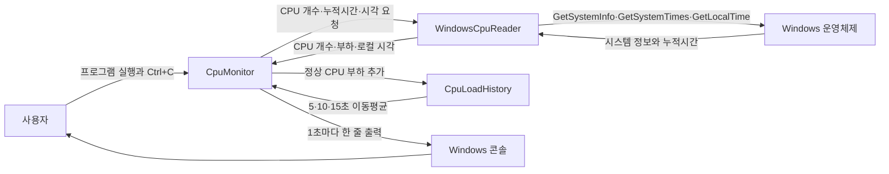
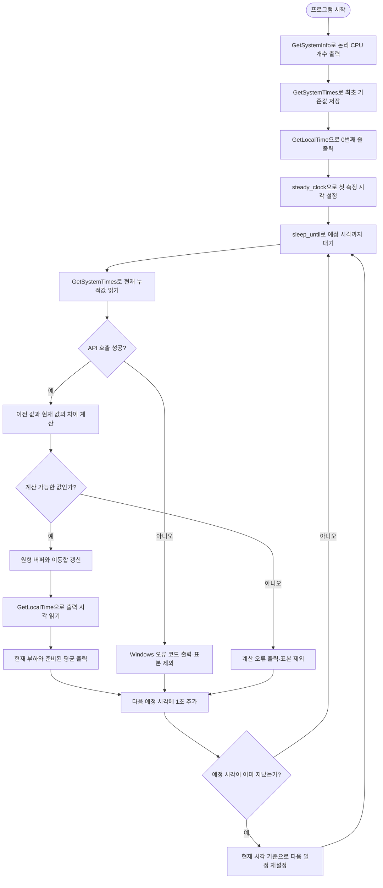
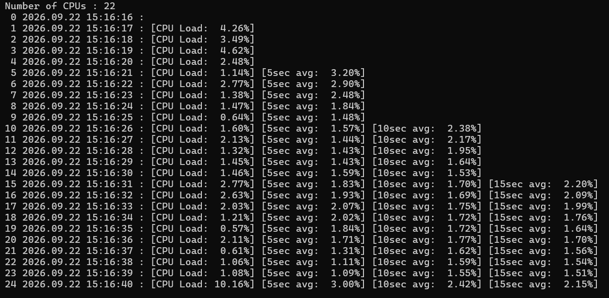
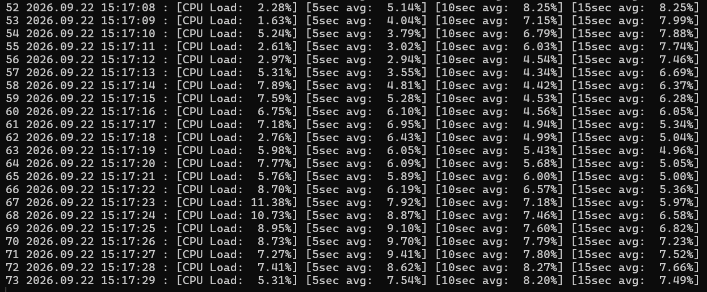

# Programming Assignment 03

## CPU Load Monitor

| 구분 | 내용 |
|---|---|
| 과목 | DCCS301 Operating System |
| 작성자 | 전남규 |
| 학번 | 2020271319 |
| 개발 언어 | C++17 |
| 개발 환경 | Windows, Visual Studio Community 2026 |
| 빌드 구성 | Release / x64 |
| 실행 파일 | `cpu.exe` |

Windows가 관리하는 누적 CPU 시간을 이용해 최근 1초 동안의 전체 CPU 부하를 계산하고, 최근 5초·10초·15초 이동평균과 현재 로컬 시각을 1초마다 출력하는 콘솔 프로그램입니다. 프로그램을 시작한 직후에는 비교할 이전 CPU 시간이 없으므로 0번째 줄에 시각만 표시하며, 첫 1초가 지난 뒤부터 실제 부하를 출력합니다.

## 목차

1. [프로그램 개요](#1-프로그램-개요)
2. [시스템 설명](#2-시스템-설명)
3. [테스트 결과 설명](#3-테스트-결과-설명)
4. [사용자 설명](#4-사용자-설명)
5. [자기 평가](#5-자기-평가)

## 1. 프로그램 개요

`cpu.exe`를 실행하면 현재 컴퓨터의 논리 프로세서 개수를 한 번 출력하고, 다음 형식으로 측정 결과를 계속 표시합니다.

```text
Number of CPUs : 22
 0 2026.09.22 15:16:16 :
 1 2026.09.22 15:16:17 : [CPU Load:  4.26%]
 5 2026.09.22 15:16:21 : [CPU Load:  1.14%] [5sec avg:  3.20%]
10 2026.09.22 15:16:26 : [CPU Load:  1.60%] [5sec avg:  1.57%] [10sec avg:  2.38%]
15 2026.09.22 15:16:31 : [CPU Load:  2.77%] [5sec avg:  1.83%] [10sec avg:  1.70%] [15sec avg:  2.20%]
```

주요 기능은 다음과 같습니다.

- `GetSystemInfo()`로 논리 프로세서 개수를 확인해 시작할 때 한 번 출력합니다.
- `GetSystemTimes()`가 반환한 두 시점의 누적시간 차이로 최근 구간의 CPU 부하를 계산합니다.
- `GetLocalTime()`으로 각 줄을 출력하는 시점의 로컬 날짜와 시간을 가져옵니다.
- 시작 직후의 값은 비교 기준으로만 저장하고 0번째 줄에는 계산되지 않은 부하를 표시하지 않습니다.
- 첫 정상 표본부터 현재 CPU 부하를 출력합니다.
- 표본이 각각 5개, 10개, 15개 모인 시점부터 해당 이동평균을 매초 새로 출력합니다.
- 최근 15개 부하만 고정 크기 원형 버퍼에 보관해 실행 시간이 길어져도 기록 공간이 늘어나지 않습니다.
- `steady_clock`과 `sleep_until()`으로 출력·계산 시간 때문에 측정 주기가 계속 밀리는 현상을 줄입니다.
- 시스템이 오랫동안 지연된 경우 지나간 측정을 한꺼번에 출력하지 않고 다음 측정 시각을 다시 맞춥니다.
- 별도의 메뉴나 입력 기능은 없으며 사용자가 `Ctrl+C`를 누를 때까지 계속 실행합니다.

## 2. 시스템 설명

### 2.1 시스템 구성

프로그램을 시작점, 전체 실행 관리, Windows 정보 조회, 이동평균 관리의 네 부분으로 나누었습니다. Windows API를 직접 다루는 코드와 평균 알고리즘을 분리해 각 부분이 한 가지 역할에 집중하도록 구성했습니다.

| 구성 요소 | 역할 |
|---|---|
| `main.cpp` | 프로그램을 시작하고 출력 실패, Windows 오류와 예상하지 못한 예외를 최종 처리합니다. |
| `CpuMonitor` | CPU 개수 출력, 최초 기준값 수집, 1초 측정 일정, 결과 출력을 관리합니다. |
| `WindowsCpuReader` | Windows API를 호출하고 `FILETIME` 변환과 CPU 부하 계산을 담당합니다. |
| `CpuLoadHistory` | 최근 15개 부하를 원형 버퍼에 보관하고 5·10·15초 이동평균을 관리합니다. |

### 2.2 사용한 Windows API

CPU 부하와 출력 시각, 프로세서 개수는 과제에서 지정한 Windows API로 가져옵니다. CPU 사용률을 임의의 다른 API로 대체하지 않았습니다.

#### `GetSystemTimes()`

[`GetSystemTimes()`](https://learn.microsoft.com/en-us/windows/win32/api/processthreadsapi/nf-processthreadsapi-getsystemtimes)는 시스템이 시작된 뒤 누적된 Idle, Kernel, User 시간을 100나노초 단위의 `FILETIME`으로 반환합니다.

- Idle time: CPU가 쉬고 있던 누적시간
- Kernel time: 운영체제 코드가 실행된 시간과 Idle time을 포함한 누적시간
- User time: 일반 프로그램 코드가 실행된 누적시간
- 성공 확인: 반환값이 0이 아닌지 검사
- 실패 처리: 실패 직후 `GetLastError()`를 읽어 Windows 오류 코드를 보존

반환값은 순간 사용률이 아니므로 한 번 읽은 값만으로는 CPU 부하를 계산할 수 없습니다. 약 1초 간격으로 읽은 이전 값과 현재 값의 차이를 사용합니다.

#### `GetLocalTime()`

[`GetLocalTime()`](https://learn.microsoft.com/en-us/windows/win32/api/sysinfoapi/nf-sysinfoapi-getlocaltime)은 현재 컴퓨터에 설정된 로컬 날짜와 시간을 `SYSTEMTIME` 구조체에 채웁니다. 프로그램은 측정 결과를 출력할 때마다 새로 호출하고 연도, 월, 일, 시, 분, 초를 사용합니다.

- 출력 형식: `YYYY.MM.DD HH:MM:SS`
- 월·일·시·분·초: 빈자리를 0으로 채워 두 자리로 표시
- 측정 주기 관리에는 사용하지 않고 사용자에게 보여 줄 실제 시각에만 사용

#### `GetSystemInfo()`

[`GetSystemInfo()`](https://learn.microsoft.com/en-us/windows/win32/api/sysinfoapi/nf-sysinfoapi-getsysteminfo)은 현재 시스템 정보를 `SYSTEM_INFO` 구조체에 채웁니다. 프로그램 시작 시 한 번 호출해 `dwNumberOfProcessors`의 논리 프로세서 개수를 출력합니다.

이 개수는 시스템 정보 표시용입니다. `GetSystemTimes()`가 제공한 전체 CPU 시간을 논리 프로세서 개수로 다시 나누지 않습니다. 0개가 반환되는 비정상 상황은 오류로 처리합니다.

### 2.3 데이터 흐름도



`CpuMonitor`가 전체 순서를 관리하고, 운영체제 값이 필요할 때 `WindowsCpuReader`에 요청합니다. 정상적으로 계산된 CPU 부하만 `CpuLoadHistory`에 전달하며, 준비된 이동평균을 받아 현재 시각과 함께 콘솔에 출력합니다.

### 2.4 프로그램 순서도



### 2.5 주요 클래스와 함수

| 클래스·함수 | 입력 | 반환값 | 역할 |
|---|---|---|---|
| `main` | 없음 | 종료 코드 | `CpuMonitor`를 실행하고 처리되지 않은 오류를 최종 정리합니다. |
| `CpuMonitor::run` | 없음 | 없음 | 최초 기준값, 반복 측정, 평균 기록과 출력을 관리합니다. |
| `printInitialLine` | 로컬 시각 | 없음 | CPU 부하가 없는 0번째 줄을 출력합니다. |
| `printSampleLine` | 표본 번호, 시각, 부하, 선택적 평균 | 없음 | 준비된 값만 과제 형식에 맞춰 한 줄로 출력합니다. |
| `logicalProcessorCount` | 없음 | 논리 프로세서 개수 | `GetSystemInfo()` 결과를 검사해 CPU 개수를 반환합니다. |
| `readCpuTimes` | 없음 | `CpuTimes` | `GetSystemTimes()`로 세 누적시간을 가져와 64비트 정수로 변환합니다. |
| `readLocalDateTime` | 없음 | `LocalDateTime` | `GetLocalTime()` 결과에서 출력에 필요한 필드를 반환합니다. |
| `calculateCpuLoad` | 이전·현재 누적시간 | CPU 부하 백분율 | 누적시간 차이와 Idle 시간을 이용해 0~100% 부하를 계산합니다. |
| `CpuLoadHistory::add` | 새 CPU 부하 | 없음 | 원형 버퍼와 세 이동합을 O(1)에 갱신합니다. |
| `average5/10/15` | 없음 | 선택적 평균 | 필요한 수의 표본이 모였을 때만 해당 이동평균을 반환합니다. |

### 2.6 CPU 부하 계산

첫 측정 시점의 누적값을 `t1`, 약 1초 뒤 값을 `t2`라고 하면 각 시간 차이는 다음과 같습니다.

```text
idleDelta   = idle(t2)   - idle(t1)
kernelDelta = kernel(t2) - kernel(t1)
userDelta   = user(t2)   - user(t1)
```

Windows의 Kernel time에는 Idle time이 포함되어 있으므로 전체 시간과 실제 작업 시간은 다음과 같이 계산합니다.

```text
totalTime = kernelDelta + userDelta
busyTime  = totalTime - idleDelta

CPU Load = busyTime / totalTime × 100
```

예를 들어 전체 시간 차이가 100이고 그중 Idle 시간 차이가 30이면 CPU가 실제로 일한 시간은 70이므로 부하는 70%입니다.

계산 전에는 현재 누적값이 이전보다 작지 않은지, 두 시간을 더할 때 64비트 정수 범위를 넘지 않는지, `totalTime`이 0이 아닌지, `idleDelta`가 전체 시간보다 크지 않은지를 확인합니다. 정상적인 부동소수점 오차 범위만 0~100% 안으로 보정하고, 관계가 크게 어긋난 값은 평균에 넣지 않습니다.

### 2.7 `FILETIME`의 64비트 변환

`FILETIME`은 하나의 큰 시간 값을 `dwLowDateTime`과 `dwHighDateTime`이라는 32비트 두 조각으로 나누어 저장합니다. 둘을 단순히 더하면 원래 값이 되지 않으므로 `ULARGE_INTEGER`의 `LowPart`와 `HighPart`에 각각 넣고 `QuadPart`를 읽어 하나의 64비트 정수로 변환합니다.

100나노초 단위를 초로 바꾸지 않고 그대로 사용합니다. 분자와 분모가 같은 단위이므로 백분율을 계산할 때 단위가 서로 소거되며, 불필요한 변환에서 생길 수 있는 정밀도 손실도 피할 수 있습니다.

### 2.8 원형 버퍼와 이동평균

과제에서 필요한 가장 긴 범위는 최근 15초이므로 `std::array<double, 15>`에 최근 15개 부하만 저장합니다. 다음 기록 위치가 배열 끝을 지나면 0번 칸으로 돌아가 가장 오래된 값을 덮어씁니다.

세 이동합은 항상 다음 의미를 유지합니다.

```text
sum5  = 현재 시점에서 가장 최근 최대 5개 부하의 합
sum10 = 현재 시점에서 가장 최근 최대 10개 부하의 합
sum15 = 현재 시점에서 가장 최근 최대 15개 부하의 합
```

새 표본이 들어올 때는 각 범위에서 빠지는 오래된 값을 먼저 빼고 새 값을 더합니다. 예를 들어 `10, 20, 30, 40, 50` 다음에 `60`이 들어오면 5초 합계에서 `10`을 빼고 `60`을 더합니다. 새로운 최근 5개는 `20, 30, 40, 50, 60`이고 평균은 40이 됩니다.

매초 최근 값을 처음부터 다시 더하지 않기 때문에 표본 추가와 각 평균 조회는 O(1)입니다. 배열 크기도 15로 고정되어 실행 시간이 길어져도 기록 메모리는 증가하지 않습니다.

표본이 충분하지 않을 때는 `std::optional`의 빈 값인 `std::nullopt`를 반환합니다. 따라서 표본이 3개뿐인데 이를 5초 평균이라고 표시하는 부분 평균이 나오지 않습니다.

### 2.9 1초 측정 주기

화면에 표시할 실제 시각은 `GetLocalTime()`으로 얻지만, 측정 간격은 컴퓨터 시각 변경의 영향을 받지 않는 `std::chrono::steady_clock`으로 관리합니다.

단순히 작업이 끝날 때마다 `sleep_for(1초)`를 사용하면 실제 주기는 `1초 + 계산 시간 + 출력 시간`이 되어 조금씩 늦어집니다. 이 프로그램은 이전 예정 시각에 1초를 더한 다음 `sleep_until()`로 그 시각까지 기다립니다. 짧은 작업 시간이 매 주기에 계속 쌓이지 않으므로 장시간 실행할 때의 누적 오차를 줄일 수 있습니다.

컴퓨터가 잠들거나 과도한 부하 때문에 다음 예정 시각을 이미 지나친 경우에는 밀린 횟수만큼 결과를 연속 출력하지 않습니다. 현재 시각에서 1초 뒤를 새 목표로 정해 각 줄이 실제 측정 구간을 나타내도록 합니다.

### 2.10 오류 처리

- `GetSystemTimes()`의 반환값을 확인하고 실패 즉시 `GetLastError()`를 보존합니다.
- 누적시간 역전, 덧셈 오버플로, 0인 전체 시간과 Idle 시간이 전체보다 큰 경우를 거부합니다.
- CPU 부하는 유한한 0~100 사이 값만 이동평균 기록에 추가합니다.
- 논리 프로세서 개수가 0으로 반환되는 비정상 상황을 오류로 처리합니다.
- 전체 표본 번호가 64비트 최대값을 넘어 0으로 돌아가는 것을 막습니다.
- 한 번의 API 또는 계산 오류는 메시지를 출력하고 해당 표본만 제외한 뒤 다음 측정을 시도합니다.
- 출력 스트림이 닫히거나 쓸 수 없는 경우 측정을 계속하지 않고 실패 종료합니다.
- 예상하지 못한 표준 예외는 `main()`에서 설명을 출력하고 실패 종료합니다.

### 2.11 알고리즘과 효율성

한 번의 측정에서 수행하는 CPU 시간 차이 계산, 이동합 갱신과 평균 조회는 입력 크기와 관계없이 정해진 횟수의 연산만 사용합니다.

- CPU 부하 계산: 측정당 O(1)
- 새 표본 추가: O(1)
- 5·10·15초 평균 갱신과 조회: 각각 O(1)
- CPU 부하 기록 공간: 15개의 `double`, O(1)
- 동적 메모리 할당: 측정 반복 중 사용하지 않음
- 대기 방식: busy waiting 대신 `sleep_until()` 사용
- 실행 스레드: 추가 스레드 없이 하나의 흐름으로 처리

측정 결과 한 줄을 만들기 위해 불필요한 큰 문자열이나 전체 실행 기록을 저장하지 않습니다. 일반 줄바꿈에는 강제 출력 비우기를 일으키는 `std::endl` 대신 `\n`을 사용합니다.

### 2.12 프로젝트 구조

```text
project/
├─ cpu.sln
├─ cpu.vcxproj
├─ cpu.vcxproj.filters
└─ src/
   ├─ main.cpp
   ├─ CpuMonitor.h
   ├─ CpuMonitor.cpp
   ├─ WindowsCpuReader.h
   ├─ WindowsCpuReader.cpp
   ├─ CpuLoadHistory.h
   └─ CpuLoadHistory.cpp
```

[전체 소스 코드 보기](project/src)

## 3. 테스트 결과 설명

### 3.1 테스트 환경

| 항목 | 환경 |
|---|---|
| 운영체제 | Windows |
| IDE | Visual Studio Community 2026 v18.10.0 |
| 컴파일러 | MSVC v145 |
| 언어 표준 | C++17 |
| 빌드 구성 | Release / x64 |
| 실행 파일 | `cpu.exe` |
| 테스트 시스템 논리 프로세서 | 22개 |

모든 실행 검증은 Release/x64 실행 파일로 진행했습니다. 실제 CPU 값은 실행할 때마다 달라지므로, 화면 출력만 확인하지 않고 이동평균에는 정답을 미리 계산할 수 있는 숫자를 넣는 별도의 임시 테스트도 사용했습니다. 임시 테스트 코드는 최종 프로그램 출력과 저장소 소스에 포함하지 않았습니다.

### 3.2 빌드와 기본 출력 테스트

| 테스트 | 실제 결과 | 판정 |
|---|---|:---:|
| Visual Studio Release/x64 빌드 | 경고 0개, 오류 0개 | 통과 |
| 실행 파일 형식 | `release\cpu.exe`, x64 | 통과 |
| 다른 폴더 재빌드 | 깨끗한 복사본도 경고 0개, 오류 0개 | 통과 |
| 논리 CPU 개수 | 시작 시 `Number of CPUs : 22` 출력 | 통과 |
| 0번째 줄 | 날짜와 시각만 표시, CPU 부하 없음 | 통과 |
| 첫 CPU 부하 | 약 1초 뒤 1번째 표본 출력 | 통과 |
| 반복 주기 | 정상 상태에서 표시 시각이 1초씩 증가 | 통과 |
| 백분율 범위 | 확인한 실제 표본이 모두 0~100% | 통과 |
| 5초 평균 시작 | 5번째 정상 표본부터 출력 | 통과 |
| 10초 평균 시작 | 10번째 정상 표본부터 출력 | 통과 |
| 15초 평균 시작 | 15번째 정상 표본부터 출력 | 통과 |
| 종료 | 콘솔에서 `Ctrl+C`로 종료 | 통과 |

### 3.3 이동평균 결정적 테스트

| 입력과 조건 | 예상값 | 실제 결과 | 판정 |
|---|---:|---:|:---:|
| `10, 20, 30, 40, 50`의 5초 평균 | 30 | 30 | 통과 |
| 위 값에 `60` 추가 후 최근 5개 평균 | 40 | 40 | 통과 |
| `1`부터 `10`까지의 10초 평균 | 5.5 | 5.5 | 통과 |
| `1`부터 `15`까지의 15초 평균 | 8 | 8 | 통과 |
| `16` 추가 후 최근 5개 평균 | 14 | 14 | 통과 |
| `16` 추가 후 최근 10개 평균 | 11.5 | 11.5 | 통과 |
| `16` 추가 후 최근 15개 평균 | 9 | 9 | 통과 |
| `1`부터 `60`까지 추가 후 최근 5개 평균 | 58 | 58 | 통과 |
| `1`부터 `60`까지 추가 후 최근 10개 평균 | 55.5 | 55.5 | 통과 |
| `1`부터 `60`까지 추가 후 최근 15개 평균 | 53 | 53 | 통과 |

16번째 값에서는 원형 버퍼가 처음 위치를 다시 사용한 뒤 첫 번째 값이 15초 범위에서 제거되는지 확인했습니다. 60번째 값까지 반복한 테스트에서는 버퍼가 여러 바퀴 순환해도 세 이동합이 정확히 유지되는 것을 확인했습니다.

### 3.4 계산 방어와 실제 부하 테스트

CPU 부하 공식은 이전 누적값을 `(Idle 100, Kernel 200, User 300)`, 현재 값을 `(Idle 150, Kernel 280, User 420)`으로 두고 검증했습니다. 전체 시간 차이는 200, 작업 시간 차이는 150이므로 예상 부하는 75%이며 실제 계산 결과도 75%였습니다.

| 테스트 | 실제 결과 | 판정 |
|---|---|:---:|
| 현재 누적값이 이전보다 작은 경우 | 계산 오류로 거부 | 통과 |
| 전체 시간 차이가 0인 경우 | 0으로 나누지 않고 거부 | 통과 |
| 100%를 넘는 부하 표본 입력 | 기록하지 않고 예외 발생 | 통과 |
| 잘못된 표본 뒤 전체 표본 수 | 기존 값 유지 | 통과 |
| 제한된 계산 부하 실행 | 현재 부하가 86.02%, 90.92%까지 상승 | 통과 |
| 부하로 예정 시각을 놓친 경우 | 밀린 줄을 연속 출력하지 않고 일정 재설정 | 통과 |

기록 공간은 코드와 결정적 테스트에서 15칸으로 고정되는 것을 확인했습니다. 실제 장시간 실행에 따른 운영체제 수준의 메모리 변화는 별도의 장시간 시험으로 측정하지 않았으므로, 측정하지 않은 수치를 임의로 기록하지 않았습니다.

### 3.5 실제 실행 화면

#### 실행 직후와 이동평균 시작

프로그램을 시작하자 논리 프로세서 22개가 표시되고, 0번째 줄에는 시각만 나타났습니다. 이후 CPU 부하가 1초마다 출력되었으며 5번째, 10번째, 15번째 표본부터 각 이동평균 항목이 순서대로 추가되었습니다.



첫 화면에서는 대부분의 현재 부하가 낮은 한 자릿수 범위에 있었고, 15초 평균이 처음 표시된 15번째 표본은 2.20%였습니다. 이는 프로그램이 시작 시점의 값을 부하로 잘못 포함하지 않고 정상 표본만 평균에 사용하고 있음을 보여 줍니다.

#### 여러 YouTube 영상 재생 중 변화

여러 YouTube 영상을 동시에 재생한 상태에서 계속 측정했습니다. 화면에 보이는 현재 부하는 1.63%부터 11.38% 사이에서 변했고, 5초 평균은 최대 9.70%, 10초 평균은 최대 8.27%까지 표시되었습니다.



현재 부하는 매초 바로 변하지만 10초·15초 평균은 이전 값도 함께 포함하므로 더 천천히 움직입니다. 두 번째 화면에서 현재 부하의 변화가 먼저 나타나고, 짧은 5초 평균과 긴 10초·15초 평균이 서로 다른 속도로 따라가는 모습을 확인할 수 있습니다.

## 4. 사용자 설명

### 4.1 준비 환경

- Windows 10 또는 Windows 11
- **Desktop development with C++** 워크로드가 설치된 Visual Studio Community 2026
- 외부 패키지는 필요하지 않습니다.
- C++ 표준 라이브러리와 Windows API만 사용합니다.

### 4.2 소스 내려받기

1. GitHub 저장소 상단의 `Code` 버튼을 누릅니다.
2. `Download ZIP`을 선택하고 압축을 풉니다.
3. `assignments\assignment-03\project` 폴더로 이동합니다.

### 4.3 Visual Studio에서 컴파일

1. `cpu.sln`을 Visual Studio Community 2026으로 엽니다.
2. 솔루션 구성은 `Release`, 플랫폼은 `x64`를 선택합니다.
3. `빌드 > 솔루션 빌드`를 누르거나 `Ctrl+Shift+B`를 입력합니다.
4. 빌드가 끝나면 다음 위치에 실행 파일이 생성됩니다.

```text
project\release\cpu.exe
```

`Ctrl+F5`를 누르면 Visual Studio에서 바로 실행할 수 있습니다. 프로그램은 자동으로 끝나지 않으므로 충분히 관찰한 뒤 `Ctrl+C`로 종료합니다.

### 4.4 PowerShell에서 실행

`project` 폴더에서 PowerShell을 열고 다음 명령을 실행합니다.

```powershell
.\release\cpu.exe
```

실행 파일이 있는 `release` 폴더에서는 다음과 같이 실행합니다.

```powershell
.\cpu.exe
```

PowerShell에서는 현재 폴더의 실행 파일을 뜻하는 `.\`을 앞에 붙입니다.

### 4.5 명령 프롬프트에서 실행

`project` 폴더에서 명령 프롬프트를 열고 다음 명령을 실행합니다.

```bat
release\cpu.exe
```

`release` 폴더에서는 다음 명령도 사용할 수 있습니다.

```bat
cpu.exe
```

### 4.6 출력 항목 이해하기

| 항목 | 의미 |
|---|---|
| `Number of CPUs` | Windows가 알려 준 논리 프로세서 개수 |
| 줄 맨 앞 숫자 | 정상적으로 계산된 CPU 부하 표본 번호 |
| 날짜와 시각 | 해당 줄을 출력할 때의 컴퓨터 로컬 시각 |
| `CPU Load` | 직전 측정부터 현재 측정까지의 전체 CPU 부하 |
| `5sec avg` | 가장 최근 5개 CPU 부하의 평균 |
| `10sec avg` | 가장 최근 10개 CPU 부하의 평균 |
| `15sec avg` | 가장 최근 15개 CPU 부하의 평균 |

0번째 줄에 CPU 부하가 없는 것은 오류가 아닙니다. 시작 직후에는 비교할 이전 누적시간이 없기 때문에 약 1초 뒤 첫 번째 부하가 계산됩니다. 평균도 필요한 수만큼 표본이 모인 뒤부터 나타납니다.

프로그램은 컴퓨터 전체의 CPU 부하를 측정합니다. 실행 중인 프로그램, 브라우저 영상, Windows 백그라운드 작업 등에 따라 값이 계속 바뀌는 것이 정상입니다.

### 4.7 종료와 문제 해결

- 종료하려면 프로그램이 실행 중인 콘솔 창을 선택하고 `Ctrl+C`를 누릅니다.
- `cpu.sln`을 빌드할 수 없다면 Visual Studio Installer에서 **Desktop development with C++** 워크로드가 설치되었는지 확인합니다.
- PowerShell에서 `cpu.exe`를 찾지 못하면 현재 위치가 `project` 폴더인지 확인하고 `.\release\cpu.exe`로 실행합니다.
- 0번째 줄에 부하가 표시되지 않는 것은 정상 동작이며 약 1초 뒤 첫 값이 나타납니다.
- 평균이 바로 나오지 않는 것도 정상입니다. 5·10·15개의 정상 표본이 모인 뒤 해당 평균이 시작됩니다.
- API 또는 계산 오류 메시지가 표시되면 괄호 안의 Windows 오류 코드와 메시지를 확인합니다. 실패한 표본은 평균에서 자동으로 제외됩니다.

## 5. 자기 평가

### 독창성: 90 / 100

이번 과제를 통해 프로그램이 운영체제와 직접 정보를 주고받는 과정을 구체적으로 이해할 수 있었습니다. 처음에는 Windows API를 호출하면 CPU 사용률이 바로 반환될 것이라고 생각하기 쉬웠지만, `GetSystemTimes()`가 주는 값은 시스템이 시작된 뒤부터 쌓인 누적시간이라는 점을 배웠습니다. 원하는 결과를 얻으려면 API를 호출하는 것뿐만 아니라 반환된 값이 어떤 의미인지 정확히 해석하는 과정이 중요하다는 것을 알게 되었습니다.

구현에는 `GetSystemTimes()`, `GetLocalTime()`, `GetSystemInfo()`를 사용했습니다. 두 시점의 Idle, Kernel, User 시간 차이를 구하고, Kernel 시간에 Idle 시간이 포함된다는 Windows의 정의를 반영해 실제 CPU가 일한 비율을 계산했습니다. 이 과정에서 `FILETIME`의 상위·하위 32비트를 하나의 64비트 값으로 합치는 방법과, 누적값을 다룰 때 오버플로나 값의 역전을 먼저 확인해야 하는 이유도 함께 익혔습니다.

이동평균을 구현하면서는 같은 결과를 내더라도 자료구조를 어떻게 선택하느냐에 따라 처리 방식이 달라진다는 점을 배웠습니다. 이번 프로그램에서는 최근 15개 값만 필요한 특성을 이용해 `std::array` 기반의 원형 버퍼를 사용했고, 범위에서 빠지는 값을 빼고 새 값을 더하는 이동합으로 5초·10초·15초 평균을 관리했습니다. 처음에는 배열이 한 바퀴 돈 뒤의 위치 계산이 헷갈렸지만, 16번째 값과 여러 번 순환한 경우를 정해진 숫자로 테스트하면서 알고리즘을 눈으로 확인하는 것보다 예상 결과가 분명한 테스트가 더 믿을 만하다는 점도 느꼈습니다.

1초 간격을 관리할 때는 화면에 표시하는 실제 시각과 측정 간격을 위한 시계를 구분했습니다. `GetLocalTime()`은 사용자에게 보여 줄 시간을 얻는 데 사용하고, 주기 제어에는 시스템 시각 변경의 영향을 받지 않는 `steady_clock`과 `sleep_until()`을 사용했습니다. 단순히 1초씩 쉬는 방식은 계산과 출력 시간만큼 계속 늦어질 수 있다는 점과, 시스템이 지연됐을 때 밀린 결과를 한꺼번에 출력하지 않도록 일정을 다시 맞추는 방법을 배웠습니다.

과제에서 제시된 API와 공식을 사용한 만큼 완전히 새로운 측정 방식을 만든 것은 아니어서 100점으로 평가하지 않았습니다. 하지만 Windows 누적시간의 의미를 이해하고, 고정 메모리 이동평균, 일정 관리, 예외 처리와 경계값 검사를 직접 구현했으며 실제 저부하 상태와 여러 영상 재생 상황에서 값의 변화를 확인했습니다. 단순히 결과가 출력되는 데서 끝내지 않고 왜 그렇게 계산되는지 설명할 수 있게 되었다는 점을 반영해 90점으로 평가했습니다.
