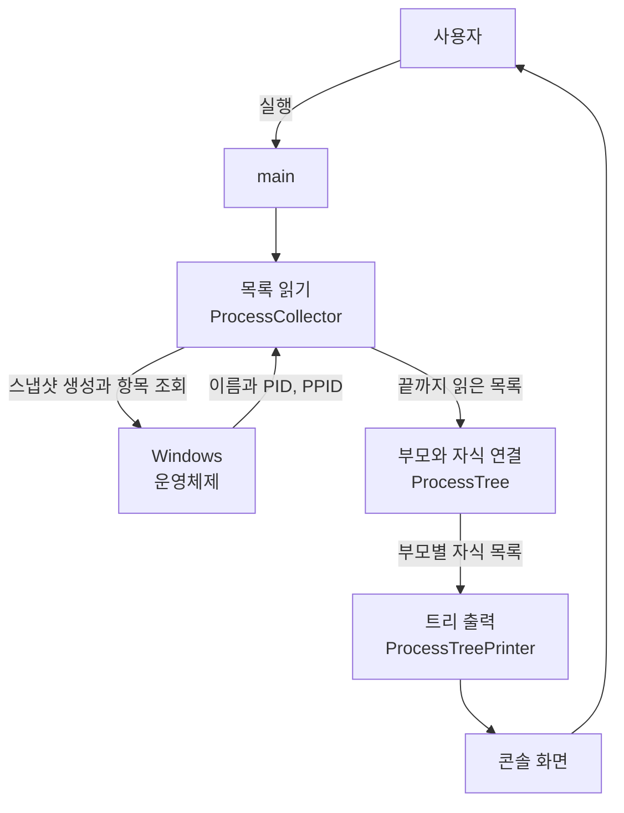
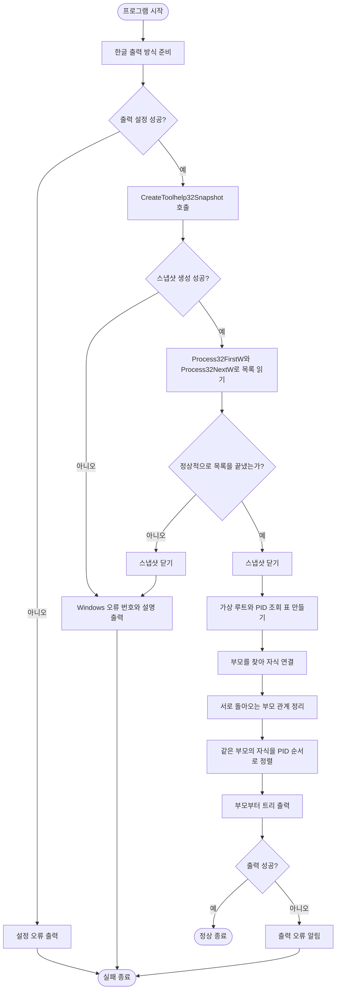
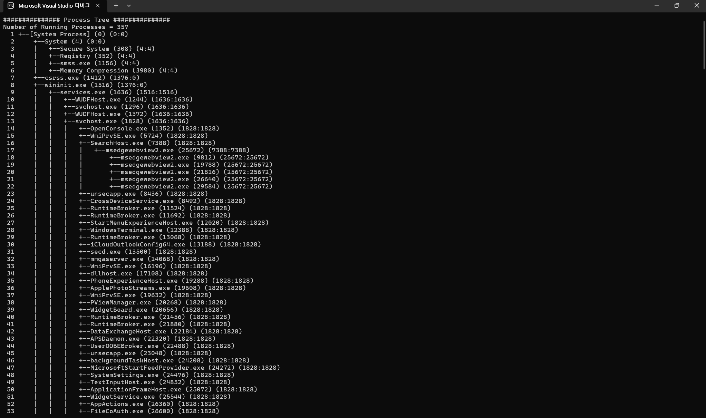
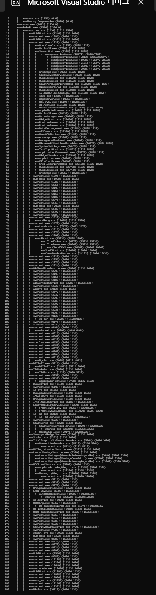
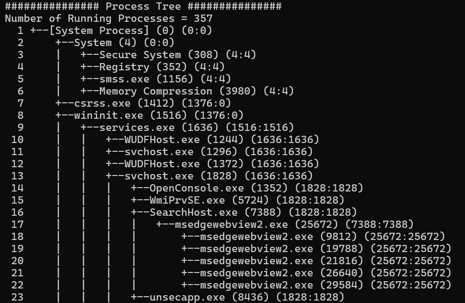

# Programming Assignment 04

## Process Tree

| 구분 | 내용 |
|---|---|
| 과목 | DCCS301 Operating System |
| 작성자 | 전남규 |
| 학번 | 2020271319 |
| 개발 언어 | C++17 |
| 개발 환경 | Windows, Visual Studio Community 2026 |
| 빌드 구성 | Release / x64 |
| 실행 파일 | `pstree.exe` |

현재 컴퓨터에서 실행 중인 프로세스의 이름, PID와 PPID를 Windows에서 가져와 부모와 자식 관계를 트리로 출력하는 콘솔 프로그램입니다. 실행할 때 받은 목록을 한 번 출력하고 종료합니다.

## 목차

1. [프로그램 개요](#1-프로그램-개요)
2. [시스템 설명](#2-시스템-설명)
3. [테스트 결과 설명](#3-테스트-결과-설명)
4. [사용자 설명](#4-사용자-설명)
5. [자기 평가](#5-자기-평가)

## 1. 프로그램 개요

프로세스는 실행 중인 프로그램을 Windows가 관리하는 단위입니다. 이 프로그램은 프로세스 목록을 받아 각 항목의 부모를 찾고, 부모 아래에 자식을 붙여 전체 관계를 보여 줍니다.

아래는 첨부한 실행 화면의 일부입니다. `357`은 촬영 당시의 개수이며, 실행 시점에 따라 달라집니다.

```text
############### Process Tree ###############
Number of Running Processes = 357
  1 +--[System Process] (0) (0:0)
  2     +--System (4) (0:0)
  7     +--csrss.exe (1412) (1376:0)
  8     +--wininit.exe (1516) (1376:0)
  9     |   +--services.exe (1636) (1516:1516)
```

주요 기능은 다음과 같습니다.

- 실행 시점의 프로세스 목록을 한 번 받아 이름, PID와 원래 PPID를 저장합니다.
- 원래 PPID와 일치하는 PID를 찾아 부모 아래에 자식을 연결합니다.
- 부모를 찾을 수 없는 프로세스는 맨 위의 가상 루트 아래에 붙입니다.
- 원래 PPID와 화면에서 연결한 부모 PID를 따로 표시합니다.
- 부모를 먼저 출력하고, 같은 부모의 자식들은 PID가 작은 순서로 출력합니다.
- 이름이 같아도 PID가 다르면 각각 출력하며, 한글 이름도 그대로 표시합니다.
- 오류가 생기면 이유를 알리고 종료하며, 사용한 스냅샷은 닫아 줍니다.

이름과 번호는 현재 컴퓨터의 실제 목록에서 가져옵니다. 과제 예시의 값을 고정해서 출력하지 않습니다. 새로운 상태를 보려면 프로그램을 다시 실행하면 됩니다.

## 2. 시스템 설명

### 2.1 시스템 구성

목록을 읽는 부분, 부모와 자식을 연결하는 부분, 화면에 출력하는 부분을 나누었습니다. `main`에서는 이 세 작업을 순서대로 호출하므로 전체 흐름을 쉽게 볼 수 있습니다.

| 구성 요소 | 역할 |
|---|---|
| [main.cpp](project/src/main.cpp) | 한글 출력 방식을 준비하고 수집 → 트리 구성 → 출력을 실행합니다. 문제가 생기면 오류를 보여 줍니다. |
| [ProcessInfo.h](project/src/ProcessInfo.h) | 프로세스 한 개의 이름, PID와 원래 PPID를 담습니다. |
| [ProcessCollector](project/src/ProcessCollector.cpp) | Windows에서 목록을 가져와 끝까지 읽고, 사용한 스냅샷을 닫습니다. |
| [ProcessTree](project/src/ProcessTree.cpp) | 부모를 찾아 자식을 연결하고, 부모가 없거나 관계가 잘못된 항목을 정리합니다. |
| [ProcessTreePrinter](project/src/ProcessTreePrinter.cpp) | 출력 순번, 들여쓰기, 연결선과 프로세스 정보를 화면에 씁니다. |

외부 라이브러리를 추가하지 않고 C++ 표준 라이브러리와 Windows API를 사용했습니다. API는 운영체제가 프로그램에 제공하는 함수입니다.

### 2.2 사용한 Windows API

과제에서 제시한 세 함수는 [ProcessCollector.cpp](project/src/ProcessCollector.cpp)에서 실제로 사용합니다. 함수 이름 끝의 `W`는 한글을 포함한 여러 언어의 글자를 다루는 유니코드 버전이라는 뜻입니다.

#### `CreateToolhelp32Snapshot()`

[`CreateToolhelp32Snapshot()`](https://learn.microsoft.com/en-us/windows/win32/api/tlhelp32/nf-tlhelp32-createtoolhelp32snapshot)은 실행 중인 프로세스 정보를 읽을 수 있는 스냅샷을 만듭니다. 스냅샷은 한 시점의 목록을 받아 두고 이후에도 같은 목록을 읽는 방식입니다.

```cpp
CreateToolhelp32Snapshot(TH32CS_SNAPPROCESS, 0)
```

- `TH32CS_SNAPPROCESS`: 시스템 전체의 프로세스 목록을 요청합니다.
- 두 번째 인수 `0`: 이 옵션에서는 특정 PID를 지정할 필요가 없으므로 0을 넣습니다.
- 성공: 받은 스냅샷을 이후의 조회 함수에 전달합니다.
- 실패: `INVALID_HANDLE_VALUE`인지 확인하고 오류를 알립니다.

목록을 읽는 동안 프로세스가 시작되거나 종료될 수 있습니다. 이름과 부모 번호를 서로 다른 시점에서 가져오지 않도록 스냅샷은 한 번만 만듭니다.

#### `Process32FirstW()`와 `Process32NextW()`

[`Process32FirstW()`](https://learn.microsoft.com/en-us/windows/win32/api/tlhelp32/nf-tlhelp32-process32firstw)는 스냅샷의 첫 항목을 읽습니다. 이후에는 [`Process32NextW()`](https://learn.microsoft.com/en-us/windows/win32/api/tlhelp32/nf-tlhelp32-process32nextw)로 다음 항목을 차례로 읽습니다.

프로세스 정보는 [`PROCESSENTRY32W`](https://learn.microsoft.com/en-us/windows/win32/api/tlhelp32/ns-tlhelp32-processentry32w)에 담겨 옵니다.

| 필드 | 가져오는 정보 | 사용하는 이유 |
|---|---|---|
| `szExeFile` | 실행파일 이름 | 화면에서 어떤 프로세스인지 보여 줍니다. |
| `th32ProcessID` | 자신의 PID | 이름이 같은 프로세스도 따로 구분합니다. |
| `th32ParentProcessID` | 원래 부모의 PID | 부모와 자식을 연결할 때 사용합니다. |
| `dwSize` | 구조체의 바이트 크기 | Windows에 전달하는 정보 공간의 크기를 알려 줍니다. |

첫 조회 전에 `entry{}`로 값을 비우고 `entry.dwSize = sizeof(entry)`를 설정합니다. 두 조회 함수가 더 읽을 항목이 없다고 알려 주는 `ERROR_NO_MORE_FILES`는 정상적인 목록 종료로 처리합니다.

이름, PID와 PPID가 모두 이 목록에 있으므로 각 프로세스에 다시 `OpenProcess()`를 호출하지 않습니다.

#### 오류 확인과 스냅샷 정리

| API | 역할과 사용 이유 |
|---|---|
| [`GetLastError()`](https://learn.microsoft.com/en-us/windows/win32/api/errhandlingapi/nf-errhandlingapi-getlasterror) | 조회 실패 직후의 오류 번호를 받습니다. 다른 함수 호출로 값이 바뀌기 전에 저장합니다. |
| [`FormatMessageW()`](https://learn.microsoft.com/en-us/windows/win32/api/winbase/nf-winbase-formatmessagew) | 오류 번호에 맞는 Windows 설명을 받아, 숫자만 보고 원인을 추측하지 않아도 되게 합니다. |
| [`CloseHandle()`](https://learn.microsoft.com/en-us/windows/win32/api/handleapi/nf-handleapi-closehandle) | 사용한 스냅샷을 닫습니다. 목록을 모두 읽었거나 도중에 오류가 났을 때도 정리합니다. |

### 2.3 데이터 흐름도



Windows에서 받은 정보는 수집 목록에 먼저 저장합니다. 트리를 만들고 출력할 때는 이 목록만 사용하므로 출력 도중의 새 프로세스 정보를 섞지 않습니다.

### 2.4 프로그램 순서도



첫 조회에서 항목이 없거나 마지막 항목 다음에 `ERROR_NO_MORE_FILES`가 나오면 정상적으로 읽기를 끝낸 것입니다. 트리 구성 중 중복 PID 같은 문제가 발견된 경우에도 `main`이 오류를 보여 주고 실패 종료합니다.

### 2.5 주요 클래스와 함수

| 클래스·함수 | 입력 | 반환값 | 역할 |
|---|---|---|---|
| `main` | 없음 | 종료 코드 | 목록을 읽고 트리를 만들어 출력합니다. 성공하면 0, 실패하면 1로 종료합니다. |
| `CollectProcesses` | 없음 | `vector<ProcessInfo>` | 한 스냅샷의 이름, PID와 PPID를 모두 읽어 돌려줍니다. |
| `SnapshotHandle` 생성자 | 스냅샷 핸들 | 없음 | Windows에서 받은 스냅샷을 보관합니다. 핸들은 사용할 대상을 가리키는 값입니다. |
| `SnapshotHandle` 소멸자 | 없음 | 없음 | 객체가 사라질 때 스냅샷을 닫아, 오류가 나도 정리가 빠지지 않게 합니다. |
| `SnapshotHandle::Get` | 없음 | `HANDLE` | 조회 함수에 전달할 스냅샷 핸들을 돌려줍니다. |
| `DescribeWindowsError` | Windows 오류 번호 | 설명 문자열 | 번호에 맞는 설명을 받고, 설명이 없으면 대체 문장을 준비합니다. |
| `ProcessCollectionError` 생성자 | 실패한 함수 이름, 오류 번호 | 없음 | `main`에서 보여 줄 함수 이름, 오류 번호와 설명을 함께 저장합니다. |
| `ProcessCollectionError::ErrorCode` | 없음 | 오류 번호 | 수집 중 발생한 Windows 오류 번호를 돌려줍니다. |
| `ProcessCollectionError::Description` | 없음 | 설명 문자열 | 저장해 둔 오류 설명을 돌려줍니다. |
| `BuildProcessTree` | 수집한 프로세스 목록 | `ProcessTree` | 부모를 찾고 자식을 붙여 출력할 트리를 만듭니다. |
| `RemoveParentCycles` | 프로세스 항목과 부모 위치 목록 | 없음 | 부모를 따라가다 같은 항목으로 돌아오면 연결 하나를 루트로 옮깁니다. |
| `PrintProcessTree` | 트리, 출력 대상 | 없음 | 제목, 개수와 전체 트리를 부모부터 차례로 출력합니다. |
| `PrintNode` | 프로세스, 순번과 출력 폭, 들여쓰기, 출력 대상 | 없음 | 프로세스 한 줄을 지정된 형식으로 출력합니다. |

주요 자료형은 다음과 같습니다. 자식 목록과 부모 위치에 저장하는 숫자는 PID 자체가 아니라 `nodes` 안에서 몇 번째 항목인지 나타내는 위치입니다.

| 자료형 | 보관하는 정보 |
|---|---|
| `ProcessInfo` | 이름 `name`, 자신의 번호 `pid`, 원래 부모 번호 `originalParentPid` |
| `ProcessTreeNode` | `ProcessInfo`, 화면용 부모 번호 `treeParentPid`, 자식 위치 목록 `children` |
| `ProcessTree` | 전체 항목 `nodes`, Windows에서 읽은 항목 수 `runningProcessCount` |
| `TraversalFrame` | 지금 출력 중인 항목의 위치 `nodeIndex`, 다음에 출력할 자식 위치 `nextChild` |
| `VisitState` | 부모를 아직 확인하지 않음, 지금 따라가는 중, 확인을 끝냄의 세 상태 |

다음 기능들도 각각 필요한 역할에 사용했습니다.

| 기능 | 사용하는 이유 |
|---|---|
| `_fileno`, `_setmode` | 화면과 오류 출력의 문자 방식을 설정해 한글 이름이 깨지지 않게 합니다. C++ 실행 환경이 제공하는 함수이며 Windows 조회 API와는 별개입니다. |
| `std::wstring` | Windows에서 받은 여러 언어의 이름과 오류 설명을 보관합니다. |
| `std::vector`, `reserve`, `push_back` | 프로세스 수에 맞게 목록을 보관하고, 예상 공간을 먼저 준비한 뒤 항목을 추가합니다. |
| `std::unordered_map`, `emplace`, `find` | PID와 목록 위치를 짝지어 저장하고, 부모를 찾을 때 전체 목록을 매번 검색하지 않도록 합니다. |
| `std::sort` | 같은 부모의 자식들을 PID가 작은 순서로 정렬합니다. |
| `std::array` | Windows 오류 설명을 받을 2,048칸의 문자 공간을 준비합니다. |
| `std::setw`, `std::to_wstring` | 출력 순번의 자릿수에 맞춰 폭을 정하고, 숫자 길이가 달라도 트리 시작 위치를 맞춥니다. |
| `std::wcout`, `std::wcerr`, `flush` | 결과와 오류를 출력하고, 마지막 내용까지 출력됐는지 확인합니다. |
| `pop_back`, 문자열 `resize` | 자식 출력을 마치면 이전 부모로 돌아가고 들여쓰기를 한 단계 줄입니다. |
| `std::runtime_error`, `std::invalid_argument`, `std::exception` | 수집 실패나 잘못된 입력 관계를 `main`에 알려 실패로 종료합니다. |
| `std::fprintf`, `errno` | 한글 출력 방식 설정 자체가 실패했을 때 오류 번호를 알립니다. |

### 2.6 PID, PPID와 한 줄의 의미

`PID`(Process ID)는 프로세스 자신의 번호이고, `PPID`(Parent Process ID)는 생성될 때 부모로 기록된 프로세스의 번호입니다. 같은 이름으로 여러 프로세스가 실행될 수 있으므로 이름 대신 PID로 구분합니다.

부모와 자식은 다음 조건으로 연결합니다.

```text
자식의 원래 PPID = 부모의 PID
```

예를 들어 `wininit.exe`의 PID가 `1516`이고 `services.exe`의 PPID가 `1516`이면, `services.exe`를 `wininit.exe` 아래에 붙입니다.

실행 화면의 다음 줄은 네 가지 정보를 담고 있습니다.

```text
9     |   +--services.exe (1636) (1516:1516)
```

| 표시 | 의미 |
|---|---|
| 맨 앞 `9` | 화면에 출력한 아홉 번째 줄입니다. PID가 아닙니다. |
| `services.exe` | Windows에서 받은 실행파일 이름입니다. |
| `(1636)` | 이 프로세스 자신의 PID입니다. |
| `(1516:1516)`의 앞 값 | Windows가 알려 준 원래 PPID입니다. |
| `(1516:1516)`의 뒤 값 | 이 프로그램의 트리에서 연결한 부모 PID입니다. |

마지막 두 값은 콜론 하나로 구분합니다. 부모를 찾았다면 두 값이 같고, 부모가 없어서 루트에 붙였다면 뒤 값이 0입니다. `System`, `Registry`, `Memory Compression` 같은 이름에도 임의로 `.exe`를 붙이지 않습니다.

### 2.7 가상 루트와 실제 System 프로세스

맨 위의 `[System Process] (0) (0:0)`은 트리를 그리기 위해 코드에서 만든 가상 루트입니다. 실제 프로세스를 새로 실행하거나, Windows의 실제 `System`과 합치는 것이 아닙니다.

| 표시 | 의미 |
|---|---|
| `[System Process] (0) (0:0)` | 모든 관계를 한 트리에 모으기 위한 화면의 맨 위 자리 |
| `System (4) (0:0)` | 실행 화면에서 Windows가 실제로 알려 준 시스템 프로세스 |
| `csrss.exe (1412) (1376:0)` | 원래 부모 번호는 1376이지만 현재 목록에서 찾지 못해 루트 아래에 붙인 프로세스 |

부모가 먼저 종료돼도 자식은 실행 중일 수 있습니다. 이런 항목을 빼지 않고 루트에 붙이되, 원래 부모 번호는 `originalParentPid`에 그대로 남깁니다. 이는 화면의 연결을 정하는 처리이며 실제 Windows의 부모 관계를 바꾸지 않습니다.

프로세스 수는 `CollectProcesses`에서 읽은 실제 항목 수로 계산합니다.

- 목록에 PID 0이 있으면 개수에는 포함하고, 화면에서는 가상 루트와 합쳐 한 번만 표시합니다.
- 목록에 PID 0이 없으면 가상 루트만 따로 추가합니다. 이때 표시 행 수는 실제 개수보다 하나 많습니다.
- 가상 루트를 만들었다는 이유로 `Number of Running Processes`를 1 증가시키지 않습니다.
- 실제 `System` 항목이 없으면 만들어 넣지 않습니다. 스냅샷 생성 실패를 루트만 출력해 숨기지도 않습니다.

### 2.8 부모 연결과 잘못된 관계 처리

먼저 모든 프로세스를 저장하고, `indexByPid`에 PID와 목록 위치를 등록합니다. 그다음 각 프로세스의 PPID를 이 표에서 찾아 부모 위치를 정합니다. 부모가 자식보다 나중에 수집돼도 이미 표에 등록되어 있으므로 연결할 수 있습니다.

정해진 부모에는 자식 위치를 `children`에 추가합니다. 출력할 때는 이 자식 목록만 사용하므로 매번 전체 프로세스 목록을 다시 찾지 않습니다.

| 관계 | 처리 방법 |
|---|---|
| 부모 PID가 목록에 있음 | 해당 부모 아래에 연결합니다. |
| 부모 PID가 목록에 없음 | 가상 루트 아래에 연결합니다. |
| 자기 PID를 부모로 가짐 | 자기 자신 아래에 붙이지 않고 가상 루트에 연결합니다. |
| 부모를 따라가다 같은 항목으로 돌아옴 | 돌아오는 관계 안에서 PID가 가장 작은 항목 하나를 루트로 옮깁니다. |
| 같은 PID가 두 번 들어옴 | 어느 항목인지 구분할 수 없으므로 오류로 처리합니다. |

서로 돌아오는 관계는 `RemoveParentCycles`에서 확인합니다. 아직 보지 않은 항목은 `Unvisited`, 지금 따라가는 경로에 있는 항목은 `Visiting`, 확인이 끝난 항목은 `Finished`로 표시합니다. 이번 경로의 `Visiting` 항목을 다시 만나면 같은 곳을 반복하는 관계입니다.

예를 들어 A의 부모가 B이고 B의 부모가 A이면 둘 사이를 계속 돌게 됩니다. 둘 중 PID가 작은 항목을 루트에 붙여 이 연결을 끊습니다. 가장 작은 PID를 고르는 이유는 수집 순서가 달라도 같은 방식으로 정리하기 위해서입니다. 원래 PPID는 바꾸지 않습니다.

이미 종료된 프로세스의 PID가 다른 프로세스에 다시 배정됐는지는 PID와 PPID만 있는 목록으로 완전히 판별할 수 없습니다. 이 프로그램은 같은 스냅샷에 기록된 번호를 기준으로 관계를 구성합니다.

### 2.9 출력 순서와 연결선

루트에서 시작해 부모를 먼저 출력하고, 그 부모 아래의 자식과 자식의 자식까지 보여 준 뒤 다음 자식으로 넘어갑니다. 이 순서가 깊이 우선 출력입니다.

같은 함수를 계속 다시 부르는 대신, 돌아올 부모를 `stack`에 차례로 기억해 반복문으로 처리합니다. 자식 관계가 깊어져도 함수 호출이 계속 쌓이지 않도록 한 것입니다.

- 한 단계 내려갈 때마다 네 칸을 추가해 부모보다 안쪽에 자식을 보여 줍니다.
- `+--`는 해당 프로세스가 연결된 자리입니다.
- 뒤에 같은 부모의 자식이 더 있으면 세로선 `|`을 이어 줍니다.
- 마지막 자식의 아래쪽에는 더 이어질 선이 없으므로 공백을 넣습니다.
- 자식들을 모두 출력하면 이전 부모로 돌아가 들여쓰기를 네 칸 줄입니다.
- 순번은 실제 출력 순서에 따라 1부터 하나씩 증가합니다.

자식 목록은 미리 PID 순서로 정렬합니다. 한 프로세스를 한 번만 출력하며, 같은 이름의 여러 항목도 각각의 PID를 기준으로 따로 표시합니다.

### 2.10 오류 처리

수집 중 문제가 생기면 일부 목록을 정상적인 전체 목록처럼 출력하지 않습니다. 실패한 함수 이름, Windows 오류 번호와 가능한 경우 설명을 보여 주고 실패 종료합니다.

| 상황 | 처리 방법 |
|---|---|
| 스냅샷 생성 실패 | `INVALID_HANDLE_VALUE`를 확인하고 오류를 알립니다. 트리는 출력하지 않습니다. |
| 첫 항목 또는 다음 항목 읽기 실패 | 실패 직후 `GetLastError()`를 저장하고 이유를 알립니다. |
| `ERROR_NO_MORE_FILES` | 더 읽을 항목이 없다는 정상 응답으로 처리합니다. |
| Windows 오류 설명이 없음 | 설명을 제공하지 않았다는 문장을 대신 표시합니다. |
| 같은 PID가 중복됨 | 잘못된 목록이라고 알리고 트리 구성을 중단합니다. |
| 메모리 부족 등 C++ 오류 | `main`에서 오류 설명을 보여 주고 실패 종료합니다. |
| 출력 설정 또는 화면 출력 실패 | 오류를 알리고 실패 종료합니다. |

스냅샷은 `SnapshotHandle`에 맡깁니다. 이 객체가 사라질 때 `CloseHandle()`을 호출하므로 끝까지 읽은 경우뿐 아니라 오류로 함수를 빠져나가는 경우에도 닫힙니다. 같은 스냅샷을 두 번 닫지 않도록 객체 복사도 막았습니다.

정상 종료 코드는 0이며 실패 종료 코드는 1입니다. 조회를 끝낸 뒤에는 스냅샷을 다시 열거나 프로세스별로 추가 조회하지 않습니다.

### 2.11 알고리즘과 효율성

N은 읽어 온 프로세스 수, D는 트리의 가장 깊은 단계 수, C는 실제로 출력한 전체 문자 수입니다.

| 작업 | 필요한 시간·공간 | 선택한 이유 |
|---|---|---|
| 스냅샷 항목 읽기 | 항목 수에 비례 | 모든 프로세스를 표시하려면 각 항목을 읽어야 합니다. |
| PID로 부모 찾기와 연결 | 평균 O(N) | PID 조회 표를 사용해 전체 목록을 매번 검색하지 않습니다. |
| 서로 돌아오는 부모 관계 검사 | O(N) | 이미 확인한 경로를 끝까지 다시 검사하지 않습니다. |
| 자식 PID 정렬 | 전체 최악 O(N log N) | 같은 부모의 자식을 일정한 순서로 보여 줍니다. |
| 트리 따라가기 | O(N) | 각 항목을 한 번씩 출력합니다. |
| 출력 문자 쓰기 | O(C) | 깊은 트리일수록 공백과 연결선도 길어집니다. |
| 프로세스·부모·자식 정보 | O(N) 공간 | 받은 목록과 관계를 한 번 저장해 재사용합니다. |
| 출력 중 돌아올 경로와 들여쓰기 | O(D) 공간 | 지금 내려간 경로만 기억합니다. |

`O(N)`은 항목 수에 비례하는 작업량이라는 뜻입니다. 해시 표인 `unordered_map`의 조회 비용은 평균 기준으로 설명한 것이며, 정렬과 실제 문자 출력을 포함한 전체 작업을 무조건 O(N)이라고 보지는 않습니다.

목록을 반복해서 받아 오거나 추가 스레드를 만들지 않습니다. 한 흐름에서 수집, 연결과 출력을 끝낸 뒤 종료합니다.

### 2.12 프로젝트 구조

```text
assignment-04/
├─ README.md
├─ images/
│  ├─ process-tree-overview.png
│  ├─ process-tree-extended.png
│  └─ process-tree-parent-child.png
└─ project/
   ├─ pstree.sln
   ├─ pstree.vcxproj
   ├─ pstree.vcxproj.filters
   └─ src/
      ├─ main.cpp
      ├─ ProcessInfo.h
      ├─ ProcessCollector.h
      ├─ ProcessCollector.cpp
      ├─ ProcessTree.h
      ├─ ProcessTree.cpp
      ├─ ProcessTreePrinter.h
      └─ ProcessTreePrinter.cpp
```

[전체 소스 코드 보기](project/src)

프로젝트 안의 파일 경로는 상대경로로 구성했습니다. 빌드하면 실행파일은 `project\bin\x64\Release\pstree.exe`에 만들어집니다. 저장소에는 소스와 프로젝트 파일을 보관하며, 생성된 실행파일과 임시 빌드 파일은 포함하지 않습니다.

## 3. 테스트 결과 설명

### 3.1 테스트 환경

| 항목 | 환경 |
|---|---|
| 운영체제 | 현재 노트북의 Windows |
| IDE | Visual Studio Community 2026 v18.10.1 |
| 도구 집합 | MSVC v145 |
| C++ 빌드 도구 버전 | 14.51.36231 |
| Windows SDK | 10.0.26100.0 |
| 언어 표준 | C++17 |
| 기본 검증 구성 | Release / x64 |
| 런타임 라이브러리 | C++ 실행 지원 기능을 실행파일에 포함하는 `/MT` 방식 |
| 실행 파일 | `pstree.exe` |

실제 Windows 실행은 일반 사용자 권한으로 확인했습니다. 빌드 도구를 통한 자동 검증과 사용자가 직접 실행해 찍은 화면을 함께 사용했습니다. 다른 컴퓨터에서의 빌드·실행은 검증하지 않았습니다.

### 3.2 빌드와 실제 출력 테스트

| 테스트 | 실제 결과 | 판정 |
|---|---|:---:|
| Visual Studio 2026 Release/x64 전체 재빌드 | 경고 없이 빌드 성공 | 통과 |
| 실행파일 이름과 형식 | `pstree.exe`, x64 확인 | 통과 |
| 일반 사용자 권한 실행 | 실제 프로세스 목록 출력, 오류 출력 없음, 종료 코드 0 | 통과 |
| 필수 API 사용 | 실행파일에 스냅샷·첫 조회·다음 조회 함수와 `CloseHandle` 포함 확인 | 통과 |
| 한 스냅샷의 원본과 트리 비교 | PID 0의 표시 통합을 제외한 항목의 이름, PID와 원래 PPID가 보존됨 | 통과 |
| 출력 순번과 부모 순서 | 순번 연속, 부모가 자식보다 먼저 출력됨 | 통과 |
| 개수와 PID 0 | 수집한 개수 유지, PID 0 중복 출력 없음 | 통과 |
| 같은 이름의 여러 프로세스 | 서로 다른 PID로 각각 표시됨 | 통과 |
| 한글 실행파일 이름 | 임시로 이름을 붙인 `한글_프로세스.exe`가 그대로 표시됨 | 통과 |
| 다른 폴더에서 빌드·실행 | 상대경로를 쓰는 복사본도 빌드와 실행 성공 | 통과 |

실제 목록을 검사할 때는 먼저 한 스냅샷을 수집하고, 그 원본으로 만든 트리와 출력을 비교했습니다. 별도 시점의 작업 관리자 개수와 같아야 한다고 판단하지 않았습니다. 프로세스는 계속 시작되거나 종료되므로 사진의 357개와 이후 실행의 개수가 달라질 수 있습니다.

### 3.3 부모 관계와 오류 처리 테스트

정답을 미리 알 수 있는 작은 목록과 실패 응답을 사용해 확인했습니다. 아래 결과는 알고리즘과 오류 처리의 검증용이며, 실제 Windows에서 이런 잘못된 관계나 API 실패가 발생했다는 뜻은 아닙니다.

| 입력·상황 | 확인한 결과 | 판정 |
|---|---|:---:|
| 자식이 부모보다 먼저 수집됨 | 부모 아래에 올바르게 연결됨 | 통과 |
| 부모 PID가 목록에 없음 | 원래 PPID 유지, 화면용 부모는 0 | 통과 |
| 자기 PID를 부모로 가짐 | 루트 아래에 연결됨 | 통과 |
| 둘 또는 셋이 서로 돌아오는 부모 관계 | 해당 관계의 가장 작은 PID를 루트에 연결 | 통과 |
| 목록 순서를 바꾸거나 뒤집음 | 같은 부모 관계와 출력 순서 유지 | 통과 |
| PID 0이 있음·없음·PID 0만 있음 | 루트 표시와 실제 개수를 각각 올바르게 처리 | 통과 |
| 실제 System 항목이 없음 | 조회하지 않은 System을 만들어 넣지 않음 | 통과 |
| 같은 PID가 중복됨 | 잘못된 목록으로 거부 | 통과 |
| 긴 이름과 여러 언어의 이름 | 받은 이름을 자르지 않고 출력 | 통과 |
| 15,000단계로 이어지는 자식 관계 | 함수 호출을 반복하지 않고 구성·출력 경로 처리 | 통과 |
| 스냅샷 생성 실패 응답 | 오류 번호·설명 표시, 정상 트리 출력 없음 | 통과 |
| 첫 조회·다음 조회 실패 응답 | 부분 목록을 내보내지 않고 열린 스냅샷 닫기 | 통과 |
| 첫 조회·다음 조회의 `ERROR_NO_MORE_FILES` | 정상 종료로 처리하고 스냅샷 닫기 | 통과 |

깊은 트리 테스트는 화면 대신 문자 수만 세는 출력 대상으로 확인했습니다. 연결선 모양은 작은 트리의 예상 문자열과 실제 출력 문자열을 비교했습니다. 임시 검증 도구와 데이터는 프로그램의 정상 실행이나 저장소의 과제 소스에 포함하지 않았습니다.

### 3.4 실제 실행 화면

아래 세 사진은 사용자가 직접 실행해 촬영한 화면입니다. 각 화면에서 확인할 수 있는 출력 부분을 나누어 설명합니다.

#### 실행 직후의 기본 출력

프로세스 개수가 357개로 표시되고, 맨 위의 가상 루트 아래에 실제 `System`과 다른 프로세스들이 출력되었습니다. `csrss.exe`와 `wininit.exe`는 원래 부모 1376을 현재 목록에서 찾지 못해 `(1376:0)`으로 표시되었습니다.



#### 긴 프로세스 목록

많은 프로세스가 이어지는 구간에서도 순번, 들여쓰기와 연결선이 유지됩니다. 같은 이름의 `svchost.exe`가 여러 번 보이지만 각각 다른 PID를 가지며, 그 아래의 자식들도 구분되어 있습니다.



#### 부모와 자식 번호 확인

`services.exe`의 `(1516:1516)`은 부모가 PID 1516의 `wininit.exe`라는 뜻입니다. 그 아래의 `svchost.exe (1828)`은 `(1636:1636)`으로 표시되어 PID 1636의 `services.exe`에 연결되어 있습니다.



## 4. 사용자 설명

### 4.1 준비 환경

- Windows와 C++ 데스크톱 개발 기능이 설치된 Visual Studio Community 2026
- 프로젝트에 지정된 Windows SDK `10.0.26100.0`과 `v145` 도구 집합
- 외부 패키지 없이 C++ 표준 라이브러리와 Windows API만 사용

SDK 버전이 다른 컴퓨터에서는 프로젝트 속성의 `일반 > Windows SDK 버전`에서 설치된 버전을 선택해야 합니다. 다른 컴퓨터에서의 동작은 별도로 확인해야 합니다.

### 4.2 소스 내려받기

1. GitHub 저장소 상단의 `Code` 버튼을 누릅니다.
2. `Download ZIP`을 선택하고 압축을 풉니다.
3. `assignments\assignment-04\project` 폴더로 이동합니다.

### 4.3 Visual Studio에서 컴파일

1. `pstree.sln`을 Visual Studio Community 2026으로 엽니다.
2. 솔루션 구성은 `Release`, 플랫폼은 `x64`를 선택합니다.
3. `빌드 > 솔루션 빌드`를 누르거나 `Ctrl+Shift+B`를 입력합니다.
4. 빌드가 끝나면 다음 위치에 실행파일이 생성됩니다.

```text
project\bin\x64\Release\pstree.exe
```

`Ctrl+F5`를 누르면 Visual Studio에서 실행할 수 있습니다. 프로그램은 트리를 한 번 출력한 뒤 종료합니다. 이후 Visual Studio가 키 입력을 기다리는 안내를 표시할 수 있지만, 이는 프로그램의 반복 실행 기능이 아닙니다.

### 4.4 PowerShell에서 실행

`project` 폴더에서 PowerShell을 열고 다음 명령을 실행합니다.

```powershell
.\bin\x64\Release\pstree.exe
```

실행파일이 있는 `bin\x64\Release` 폴더에서는 다음과 같이 실행합니다.

```powershell
.\pstree.exe
```

PowerShell에서는 현재 폴더의 실행파일을 뜻하는 `.\`을 앞에 붙입니다.

### 4.5 명령 프롬프트에서 실행

`project` 폴더에서 명령 프롬프트를 열고 다음 명령을 실행합니다.

```bat
bin\x64\Release\pstree.exe
```

`bin\x64\Release` 폴더에서는 다음 명령도 사용할 수 있습니다.

```bat
pstree.exe
```

### 4.6 출력 확인과 종료

- `Process Tree` 아래에 실행 시점의 프로세스 개수가 표시됩니다.
- 각 줄은 `순번 + 연결선 + 이름 (PID) (원래 PPID:화면용 부모 PID)` 순서입니다.
- 부모가 있으면 마지막 두 번호가 같고, 루트로 옮긴 항목은 뒤 번호가 0입니다.
- `[System Process]`는 화면용 가상 루트이고, 실제 `System`은 별도의 항목입니다.
- 한 번 출력하고 자동 종료하므로 종료 키를 누를 필요가 없습니다.
- 새로운 목록을 확인하려면 같은 명령을 다시 실행합니다.

다른 컴퓨터에서는 실행 중인 프로그램과 PID가 다르므로 사진과 이름·번호·개수가 같을 필요는 없습니다.

### 4.7 실행되지 않는 경우

- 빌드 도구를 찾지 못하면 Visual Studio Installer에서 **Desktop development with C++** 설치 여부를 확인합니다.
- SDK를 찾지 못하면 설치된 SDK 버전을 확인하고 프로젝트 설정에서 선택합니다.
- 실행파일을 찾지 못하면 현재 폴더와 `bin\x64\Release\pstree.exe` 생성 여부를 확인합니다.
- 창이 바로 닫히면 PowerShell이나 명령 프롬프트를 먼저 열고 실행해 결과를 확인합니다.
- Windows 오류가 표시되면 실패한 함수 이름, 오류 번호와 설명을 확인합니다. 그 실행에서는 정상 트리를 출력하지 않습니다.
- 명령 프롬프트에서 `>`로 출력을 파일에 저장하면 UTF-16LE로 기록되므로, 편집기에서 해당 문자 형식으로 열면 됩니다.

## 5. 자기 평가

### 독창성: 90 / 100

이번 프로그램을 만들면서 Windows API로 현재 노트북의 실제 프로세스 정보를 가져오고, 그 정보로 트리를 구성하는 흐름을 이해했습니다. 같은 이름의 프로세스도 PID가 다르면 각각 구분해야 하며, 자식의 PPID와 부모의 PID를 비교해 부모와 자식 관계를 찾는다는 점을 실제 출력과 연결해 알게 되었습니다.

특히 부모가 먼저 종료되어도 자식은 계속 실행될 수 있고, 자식에 원래 부모 번호가 남아 있다는 점을 새롭게 이해했습니다. 부모를 찾지 못한 항목을 0번 아래에 붙이는 것은 우리 프로그램이 화면에 보여 주기 위한 처리이며, Windows가 실제 부모를 0번으로 바꾸는 것은 아니라는 점도 구분하게 되었습니다. 원래 부모 번호와 화면에 연결할 부모 번호를 따로 보관한 이유를 이해하면서, 출력의 두 숫자가 왜 필요한지도 명확해졌습니다.

부모를 찾을 때마다 전체 목록을 검색하지 않도록 PID 조회 표를 만들고, 부모별 자식도 미리 모았습니다. 수집 순서가 바뀌어도 연결되도록 모든 PID를 먼저 등록했으며, 자기 자신을 부모로 갖거나 서로 돌아오는 관계도 출력에서 빠지지 않게 처리했습니다. 출력은 돌아올 위치를 기억하는 반복문으로 구성해 깊은 트리도 다룰 수 있게 했습니다.

가상 루트와 실제 `System`을 구분하고, PID 0을 두 번 표시하거나 가상 루트 때문에 개수가 늘어나지 않도록 했습니다. 수집, 트리 구성과 출력을 나누고 주석에는 코드의 역할과 이유를 쉬운 말로 적었습니다. 실제 실행 화면뿐 아니라 정답이 정해진 목록과 오류 응답으로 확인해, 평소 실행에서 잘 드러나지 않는 경우도 검사했습니다.

기본 기능과 API는 과제에서 제시한 것이므로 완전히 새로운 프로그램이라고 보지는 않았습니다. 또한 스냅샷 정보만으로 PID 재사용까지 완전히 판별할 수는 없습니다. 이러한 한계를 남기되, 부모 정보 보존, 일관된 출력, 잘못된 관계 처리와 검증을 함께 갖춘 점을 반영해 90점으로 평가했습니다.
